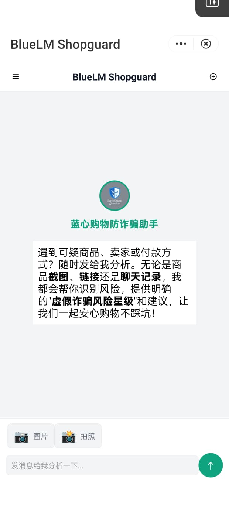

# BlueLM Shopguard - 购物防诈骗助手

<div align="center">
  
  <p>
    <strong>智能购物防诈骗助手，基于大语言模型，帮助您识别商品风险</strong>
  </p>
  <p>
    <a href="https://github.com/bluelm-shopguard/bluelm-shopguard"><strong>主项目仓库</strong></a>
    ·
    <a href="https://shopguard-chatbot.readthedocs.io/"><strong>在线文档</strong></a>
    ·
    <a href="https://github.com/bluelm-shopguard/shopguard-chatbot/tree/master"><strong>webapp分支</strong></a>
  </p>
</div>

## 📱 项目概述

BlueLM Shopguard 是一款专为识别购物诈骗风险设计的智能助手应用。用户可以发送商品截图、链接或聊天记录，AI 将分析内容并提供风险评估。项目支持网页版和快应用两种形式，本仓库主要包含快应用前端的实现。

### 主要功能

- 🔍 **图片识别**：分析商品图片中的风险信息
- 💬 **聊天记录分析**：识别卖家聊天中的诈骗迹象
- ⭐ **风险评级**：提供直观的"诈骗风险星级"评分
- 🛡️ **购物建议**：针对不同风险提供专业防骗建议

## 🚀 快速开始

### 环境要求

- 快应用环境：支持快应用的安卓设备或模拟器
- 快应用开发环境：快应用IDE或命令行工具

### 安装运行

1. 克隆仓库：

```bash
git clone https://github.com/bluelm-shopguard/shopguard-chatbot.git
cd shopguard-chatbot
```

2. 安装依赖：

```bash
npm install
```

3. 配置 API 连接：

打开 `src/helper/system-settings.js` 更新 API 配置：

```javascript
    API: {
    endpoint: 'YOUR_BASE_URL/chat/completions',
    model: 'MODEL_NAME',
    }
```

4. 启动开发服务器：

```bash
npm run serve
```

5. 构建生产版本：

```bash
npm run build
```

#### 打包快应用

使用快应用IDE打包，或者使用命令行工具

## 📁 项目结构

```
shopguard-chatbot/
├── docs/                 # 项目文档
├── src/                  # 源代码
│   ├── app.ux            # 快应用入口文件
│   ├── manifest.json     # 快应用配置文件
│   ├── homepage.html     # 网页版主页面
│   ├── common/           # 共享资源
│   │   ├── images/       # 图片资源
│   │   └── styles/       # 样式文件
│   ├── data/             # 数据管理
│   │   ├── system-settings.js  # 系统设置
│   │   └── user-settings.js    # 用户设置
│   ├── js/               # JavaScript 模块
│   └── pages/            # 子页面
└── mkdocs.yml            # 文档配置
```

## ⚙️ 配置说明

### 系统设置

编辑 `src/helper/system-settings.js` 可配置：

- API 端点和模型
- 功能开关
- 错误信息和欢迎语

### 用户设置

`src/helper/user-settings.js` 存储用户首选项：

- 主题设置
- 语言选择
- 历史记录保存选项

这些设置会自动保存到 localStorage。

## 🛠️ 开发指南

完整的文档请访问 [在线文档](https://shopguard-chatbot.readthedocs.io/)

## 📱 快应用兼容性

- 兼容华为、OPPO、VIVO、小米等支持快应用标准的设备
- 最低平台版本：1070

## 👥 贡献指南

欢迎贡献代码、报告问题或提出新功能建议！

1. Fork 本仓库
2. 创建您的特性分支: `git checkout -b feature/amazing-feature`
3. 提交您的更改: `git commit -m 'Add some amazing feature'`
4. 推送到分支: `git push origin feature/amazing-feature`
5. 提交 Pull Request
