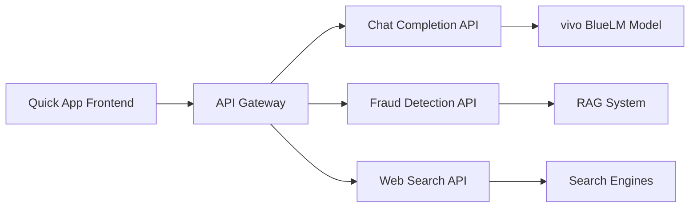

# API Overview

ShopGuard chatbot uses a comprehensive API architecture that combines OpenAI-compatible endpoints with specialized fraud detection capabilities. This section provides an overview of the available APIs and integration patterns.

## API Architecture



## Available APIs

### 1. Chat Completion API
OpenAI-compatible chat completion endpoint that powers the conversational interface.

- **Endpoint**: `/v1/chat/completions`
- **Method**: `POST`
- **Format**: OpenAI GPT API compatible
- **Features**: Streaming responses, multiple models, context management

### 2. Fraud Detection API
Specialized endpoints for analyzing shopping links and providing fraud risk assessments.

- **Risk Analysis**: Evaluate shopping links and product listings
- **Price Validation**: Check price reasonability against market data
- **Seller Verification**: Assess seller credibility and reputation
- **Multi-dimensional Scoring**: 0-10 star risk rating system

### 3. Multi-modal Processing
Handle text and image inputs for comprehensive fraud analysis.

- **Image OCR**: Extract text from screenshots and images
- **Visual Analysis**: Analyze product images and shopping interfaces
- **Content Understanding**: Process both text and visual information

### 4. RAG Integration
Retrieval-Augmented Generation for enhanced fraud detection knowledge.

- **Knowledge Base**: Access to extensive fraud pattern database
- **Semantic Search**: Intelligent matching of user queries to relevant cases
- **Context Enhancement**: Improved accuracy through knowledge retrieval

## Authentication

### API Key Authentication

```javascript
const client = new OpenAI({
  apiKey: "your-api-key",
  baseURL: "http://localhost:8000/v1"
});
```

### Request Headers

```http
POST /v1/chat/completions
Content-Type: application/json
Authorization: Bearer your-api-key
User-Agent: ShopGuard-Chatbot/1.0
```

## Response Formats

### Standard Chat Response

```json
{
  "id": "chatcmpl-123",
  "object": "chat.completion",
  "created": 1677652288,
  "model": "vivo-BlueLM-TB-Pro",
  "choices": [{
    "index": 0,
    "message": {
      "role": "assistant",
      "content": "I'll help you analyze this shopping link for potential fraud..."
    },
    "finish_reason": "stop"
  }],
  "usage": {
    "prompt_tokens": 56,
    "completion_tokens": 31,
    "total_tokens": 87
  }
}
```

### Fraud Analysis Response

```json
{
  "response": "Detailed fraud analysis response...",
  "reason": "Price significantly below market value, seller information incomplete...",
  "risk_level": "7星",
  "advice": "Exercise caution, consider purchasing from official channels...",
  "analysis": {
    "price_score": 8,
    "seller_score": 6,
    "platform_score": 5,
    "overall_risk": 7
  }
}
```

### Streaming Response

```javascript
const stream = await client.chat.completions.create({
  model: "vivo-BlueLM-TB-Pro",
  messages: messages,
  stream: true,
});

for await (const chunk of stream) {
  const content = chunk.choices[0]?.delta?.content || '';
  if (content) {
    console.log(content);
  }
}
```

## Error Handling

### Standard Error Response

```json
{
  "error": {
    "message": "Invalid request: missing required parameter 'messages'",
    "type": "invalid_request_error",
    "param": "messages",
    "code": "missing_parameter"
  }
}
```

### Common Error Codes

| Code | Description | Resolution |
|------|-------------|------------|
| `400` | Bad Request | Check request format and parameters |
| `401` | Unauthorized | Verify API key and authentication |
| `429` | Rate Limited | Implement exponential backoff |
| `500` | Server Error | Retry request, contact support if persistent |
| `503` | Service Unavailable | Backend service may be down |

## Rate Limiting

### Default Limits

- **Requests per minute**: 100
- **Tokens per minute**: 50,000
- **Concurrent requests**: 10

### Rate Limit Headers

```http
X-RateLimit-Limit: 100
X-RateLimit-Remaining: 99
X-RateLimit-Reset: 1677652348
Retry-After: 60
```

## Integration Patterns

### Basic Chat Integration

```javascript
// Initialize client
const client = new OpenAI({
  apiKey: process.env.API_KEY,
  baseURL: "http://localhost:8000/v1"
});

// Send chat message
async function sendMessage(userMessage, history = []) {
  const messages = [
    ...history,
    { role: "user", content: userMessage }
  ];
  
  const completion = await client.chat.completions.create({
    model: "vivo-BlueLM-TB-Pro",
    messages: messages,
    temperature: 0.7,
    max_tokens: 1024
  });
  
  return completion.choices[0].message.content;
}
```

### Fraud Detection Integration

```javascript
// Analyze shopping link
async function analyzeShoppingLink(url, description) {
  const prompt = `Please analyze this shopping link for potential fraud: ${url}. Product: ${description}`;
  
  const response = await client.chat.completions.create({
    model: "vivo-BlueLM-TB-Pro",
    messages: [{ role: "user", content: prompt }],
    temperature: 0.3, // Lower temperature for analytical tasks
    user: "fraud_detection"
  });
  
  // Parse structured response
  const analysis = parseAnalysisResponse(response.choices[0].message.content);
  return analysis;
}
```

### Streaming Chat Implementation

```javascript
async function streamChat(message, onChunk, onComplete) {
  try {
    const stream = await client.chat.completions.create({
      model: "vivo-BlueLM-TB-Pro",
      messages: [{ role: "user", content: message }],
      stream: true,
      max_tokens: 1024
    });

    let fullResponse = '';
    
    for await (const chunk of stream) {
      const content = chunk.choices[0]?.delta?.content || '';
      if (content) {
        fullResponse += content;
        onChunk(content);
      }
    }
    
    onComplete(fullResponse);
  } catch (error) {
    console.error('Streaming error:', error);
    throw error;
  }
}
```

## Best Practices

### 1. Error Resilience

```javascript
async function robustApiCall(requestData, maxRetries = 3) {
  for (let attempt = 1; attempt <= maxRetries; attempt++) {
    try {
      return await client.chat.completions.create(requestData);
    } catch (error) {
      if (attempt === maxRetries) throw error;
      
      // Exponential backoff
      const delay = Math.pow(2, attempt) * 1000;
      await new Promise(resolve => setTimeout(resolve, delay));
    }
  }
}
```

### 2. Context Management

```javascript
class ChatContext {
  constructor(maxMessages = 20) {
    this.messages = [];
    this.maxMessages = maxMessages;
  }
  
  addMessage(role, content) {
    this.messages.push({ role, content });
    
    // Keep context within limits
    if (this.messages.length > this.maxMessages) {
      this.messages = this.messages.slice(-this.maxMessages);
    }
  }
  
  getContext() {
    return [...this.messages];
  }
}
```

### 3. Performance Optimization

```javascript
// Use appropriate temperature settings
const settings = {
  chat: { temperature: 0.7 },
  analysis: { temperature: 0.3 },
  creative: { temperature: 0.9 }
};

// Implement request deduplication
const requestCache = new Map();

async function cachedRequest(key, requestFn) {
  if (requestCache.has(key)) {
    return requestCache.get(key);
  }
  
  const result = await requestFn();
  requestCache.set(key, result);
  
  // Clean cache after 5 minutes
  setTimeout(() => requestCache.delete(key), 5 * 60 * 1000);
  
  return result;
}
```

## Testing and Development

### API Testing Tools

- **Postman Collection**: Available for testing all endpoints
- **curl Examples**: Command-line testing scripts
- **Unit Tests**: Automated testing suite
- **Integration Tests**: End-to-end API testing

### Development Environment

```bash
# Start local backend server
python backend/main.py

# Test API connectivity
curl -X POST http://localhost:8000/v1/chat/completions \
  -H "Content-Type: application/json" \
  -H "Authorization: Bearer test-key" \
  -d '{"model":"vivo-BlueLM-TB-Pro","messages":[{"role":"user","content":"Hello"}]}'
```

## Next Steps

- **[Backend API Details](backend.md)**: Deep dive into backend implementation
- **[OpenAI Compatibility](openai-compatibility.md)**: Full compatibility reference
- **[Usage Examples](examples.md)**: Practical implementation examples
- **[Integration Tutorial](../tutorials/basic-chat.md)**: Step-by-step integration guide
