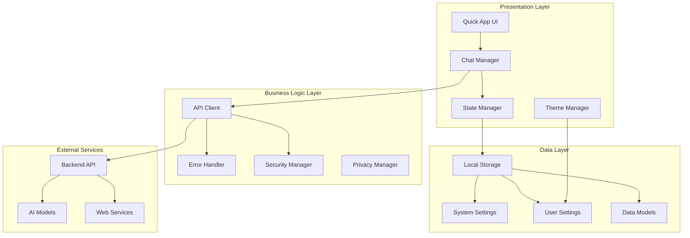

# Frontend Architecture

This document provides a comprehensive overview of the ShopGuard chatbot frontend architecture, built as a Quick App for vivo devices.

## Architecture Overview

ShopGuard frontend follows a modular architecture optimized for Quick App deployment and AI-powered chat experiences:



## Frontend Architecture

### Quick App Structure

The frontend follows Quick App framework conventions with a modular design:

```
src/
├── app.ux                 # Application entry point
├── manifest.json          # App configuration
├── pages/                 # Page components
│   ├── chat/             # Main chat interface
│   │   ├── index.ux      # Chat page component
│   │   ├── chat.css      # Chat-specific styles
│   │   └── chat.js       # Chat logic
│   ├── settings/         # Settings page
│   └── about/            # About page
├── components/           # Reusable components
│   ├── message-bubble/   # Chat message component
│   ├── input-bar/        # Message input component
│   └── sidebar/          # Navigation sidebar
├── common/               # Shared resources
│   ├── styles/           # Global styles
│   ├── images/           # Image assets
│   └── utils/            # Utility functions
└── data/                 # Configuration and data
    ├── system-settings.js
    └── user-settings.js
```

### Component Architecture

#### Chat Manager
Handles all chat-related functionality:

```javascript
// chat-manager.js
class ChatManager {
  constructor() {
    this.messages = [];
    this.isConnected = false;
    this.apiClient = new APIClient();
    this.messageQueue = [];
  }
  
  async sendMessage(content, type = 'text') {
    const message = {
      id: this.generateId(),
      role: 'user',
      content,
      type,
      timestamp: Date.now(),
      status: 'sending'
    };
    
    this.addMessage(message);
    
    try {
      const response = await this.apiClient.sendMessage(content);
      this.handleResponse(response, message.id);
    } catch (error) {
      this.handleError(error, message.id);
    }
  }
  
  addMessage(message) {
    this.messages.push(message);
    this.notifyObservers('messageAdded', message);
  }
  
  // Observer pattern for UI updates
  subscribe(callback) {
    this.observers.push(callback);
  }
}
```

#### State Manager
Centralized state management:

```javascript
// state-manager.js
class StateManager {
  constructor() {
    this.state = {
      user: null,
      settings: {},
      chatHistory: [],
      currentSession: null,
      ui: {
        theme: 'light',
        sidebarOpen: false,
        isLoading: false
      }
    };
    this.listeners = new Map();
  }
  
  setState(key, value) {
    const oldValue = this.state[key];
    this.state[key] = value;
    this.notifyListeners(key, value, oldValue);
    this.persistState();
  }
  
  getState(key) {
    return this.state[key];
  }
  
  subscribe(key, callback) {
    if (!this.listeners.has(key)) {
      this.listeners.set(key, []);
    }
    this.listeners.get(key).push(callback);
  }
}
```

### UI Components

#### Message Bubble Component
```xml
<!-- message-bubble.ux -->
<template>
  <div class="message-bubble {{role}}" id="{{messageId}}">
    <div class="avatar" if="{{showAvatar}}">
      <image src="{{avatarUrl}}" class="avatar-image"></image>
    </div>
    <div class="content">
      <div class="message-text">{{content}}</div>
      <div class="message-meta">
        <text class="timestamp">{{formatTime(timestamp)}}</text>
        <text class="status {{status}}" if="{{role === 'user'}}">{{statusText}}</text>
      </div>
    </div>
  </div>
</template>

<style>
.message-bubble {
  display: flex;
  margin: 12px 16px;
  max-width: 80%;
}

.message-bubble.user {
  align-self: flex-end;
  flex-direction: row-reverse;
}

.message-bubble.assistant {
  align-self: flex-start;
}

.content {
  background-color: #f0f0f0;
  border-radius: 18px;
  padding: 12px 16px;
  position: relative;
}

.message-bubble.user .content {
  background-color: #007AFF;
  color: white;
}
</style>

<script>
export default {
  props: {
    messageId: String,
    role: String,
    content: String,
    timestamp: Number,
    status: String,
    showAvatar: Boolean,
    avatarUrl: String
  },
  
  computed: {
    statusText() {
      const statusMap = {
        'sending': '发送中',
        'sent': '已发送',
        'delivered': '已送达',
        'error': '发送失败'
      };
      return statusMap[this.status] || '';
    }
  },
  
  methods: {
    formatTime(timestamp) {
      return new Date(timestamp).toLocaleTimeString('zh-CN', {
        hour: '2-digit',
        minute: '2-digit'
      });
    }
  }
}
</script>
```

## API Integration Architecture

### API Client Design

The frontend uses a centralized API client for all backend communication:

```javascript
// src/js/api-client.js
class APIClient {
    constructor() {
        this.baseURL = SystemSettings.api.endpoint;
        this.apiKey = SystemSettings.api.apiKey;
        this.model = SystemSettings.api.model;
    }
    
    async sendMessage(messages, options = {}) {
        const payload = {
            model: this.model,
            messages: messages,
            stream: options.stream || false,
            temperature: options.temperature || 0.7,
            max_tokens: options.maxTokens || 2000,
            ...options
        };
        
        const response = await fetch(this.baseURL, {
            method: 'POST',
            headers: {
                'Content-Type': 'application/json',
                'Authorization': `Bearer ${this.apiKey}`
            },
            body: JSON.stringify(payload)
        });
        
        if (!response.ok) {
            throw new Error(`API request failed: ${response.status}`);
        }
        
        if (options.stream) {
            return this._handleStreamResponse(response);
        } else {
            return await response.json();
        }
    }
    
    async _handleStreamResponse(response) {
        const reader = response.body.getReader();
        const decoder = new TextDecoder();
        
        return {
            async *[Symbol.asyncIterator]() {
                try {
                    while (true) {
                        const { done, value } = await reader.read();
                        if (done) break;
                        
                        const chunk = decoder.decode(value);
                        const lines = chunk.split('\n');
                        
                        for (const line of lines) {
                            if (line.startsWith('data: ')) {
                                const data = line.slice(6);
                                if (data === '[DONE]') return;
                                
                                try {
                                    const parsed = JSON.parse(data);
                                    yield parsed;
                                } catch (e) {
                                    console.warn('Failed to parse SSE data:', data);
                                }
                            }
                        }
                    }
                } finally {
                    reader.releaseLock();
                }
            }
        };
    }
}
```

### Error Handling

```javascript
// src/js/error-handler.js
class ErrorHandler {
    static handleAPIError(error, context = {}) {
        const errorInfo = {
            timestamp: new Date().toISOString(),
            context,
            error: {
                message: error.message,
                stack: error.stack,
                name: error.name
            }
        };
        
        console.error('API Error:', errorInfo);
        
        // Show user-friendly error message
        switch (error.status) {
            case 401:
                return 'Authentication failed. Please check your API key.';
            case 429:
                return 'Too many requests. Please try again later.';
            case 500:
                return 'Server error. Please try again later.';
            default:
                return 'An unexpected error occurred. Please try again.';
        }
    }
    
    static handleNetworkError() {
        return 'Network connection failed. Please check your internet connection.';
    }
}
```

## Data Management

### Local Storage Strategy

The frontend uses browser storage APIs for persisting user data:

```javascript
// src/js/storage-manager.js
class StorageManager {
    constructor() {
        this.prefix = 'shopguard_';
    }
    
    // Chat history management
    saveChatHistory(sessionId, messages) {
        const key = `${this.prefix}chat_${sessionId}`;
        const data = {
            messages,
            timestamp: Date.now(),
            sessionId
        };
        localStorage.setItem(key, JSON.stringify(data));
    }
    
    getChatHistory(sessionId) {
        const key = `${this.prefix}chat_${sessionId}`;
        const data = localStorage.getItem(key);
        return data ? JSON.parse(data) : null;
    }
    
    // User preferences
    saveUserSettings(settings) {
        localStorage.setItem(`${this.prefix}user_settings`, JSON.stringify(settings));
    }
    
    getUserSettings() {
        const data = localStorage.getItem(`${this.prefix}user_settings`);
        return data ? JSON.parse(data) : UserSettings;
    }
    
    // Session management
    createSession() {
        const sessionId = `session_${Date.now()}_${Math.random().toString(36).substr(2, 9)}`;
        const session = {
            id: sessionId,
            title: "New Chat",
            createdAt: Date.now(),
            messages: []
        };
        
        this.saveChatHistory(sessionId, []);
        return session;
    }
    
    getAllSessions() {
        const sessions = [];
        for (let i = 0; i < localStorage.length; i++) {
            const key = localStorage.key(i);
            if (key.startsWith(`${this.prefix}chat_`)) {
                const data = JSON.parse(localStorage.getItem(key));
                sessions.push({
                    id: data.sessionId,
                    title: this.generateChatTitle(data.messages),
                    createdAt: data.timestamp,
                    messageCount: data.messages.length
                });
            }
        }
        return sessions.sort((a, b) => b.createdAt - a.createdAt);
    }
    
    generateChatTitle(messages) {
        const firstUserMessage = messages.find(m => m.role === 'user');
        if (firstUserMessage) {
            return firstUserMessage.content.slice(0, 30) + (firstUserMessage.content.length > 30 ? '...' : '');
        }
        return "New Chat";
    }
}
```

### Data Models

```javascript
// src/js/data-models.js
class Message {
    constructor(role, content, type = 'text') {
        this.id = `msg_${Date.now()}_${Math.random().toString(36).substr(2, 9)}`;
        this.role = role; // 'user', 'assistant', 'system'
        this.content = content;
        this.type = type; // 'text', 'image', 'file'
        this.timestamp = Date.now();
        this.status = 'sent'; // 'sending', 'sent', 'error'
    }
}

class ChatSession {
    constructor(title = "New Chat") {
        this.id = `session_${Date.now()}_${Math.random().toString(36).substr(2, 9)}`;
        this.title = title;
        this.createdAt = Date.now();
        this.updatedAt = Date.now();
        this.messages = [];
        this.isActive = true;
    }
    
    addMessage(message) {
        this.messages.push(message);
        this.updatedAt = Date.now();
    }
    
    getContext(maxMessages = 10) {
        // Return recent messages for API context
        return this.messages
            .slice(-maxMessages)
            .map(msg => ({
                role: msg.role,
                content: msg.content
            }));
    }
}
```

### Configuration Management

The frontend uses direct JavaScript configuration files instead of environment files for simplicity and transparency:

```javascript
// src/data/system-settings.js
export let SystemSettings = {
    // API Configuration
    api: {
        endpoint: "http://localhost:8000/v1/chat/completions",
        model: "vivo-BlueLM-TB-Pro",
        apiKey: "default-key"
    },
    
    // App Configuration  
    app: {
        name: "ShopGuard Assistant",
        version: "1.0.0",
        environment: "development"
    },
    
    // Feature Flags
    features: {
        ragEnabled: true,
        searchEnabled: true,
        multiModalEnabled: true,
        darkModeEnabled: true
    },
    
    // UI Configuration
    ui: {
        theme: "auto",
        maxMessages: 100,
        typingAnimationSpeed: 50,
        showTimestamps: true
    }
};
```

```javascript
// src/data/user-settings.js  
export let UserSettings = {
    // User preferences (automatically managed)
    theme: "auto",
    fontSize: "medium", 
    language: "zh-CN",
    notifications: true,
    
    // Chat preferences
    chat: {
        sendOnEnter: true,
        showTypingIndicator: true,
        autoScroll: true
    }
};
```

## Security Considerations

### API Key Management

```javascript
// src/js/security-manager.js
class SecurityManager {
    static validateApiKey(apiKey) {
        // Basic API key format validation
        if (!apiKey || apiKey.length < 10) {
            throw new Error('Invalid API key format');
        }
        
        // Check for placeholder values
        const invalidKeys = ['default-key', 'your-api-key', 'test-key'];
        if (invalidKeys.includes(apiKey.toLowerCase())) {
            console.warn('Using placeholder API key. Please update system settings.');
        }
        
        return true;
    }
    
    static sanitizeInput(input) {
        // Basic input sanitization
        if (typeof input !== 'string') return input;
        
        return input
            .replace(/<script\b[^<]*(?:(?!<\/script>)<[^<]*)*<\/script>/gi, '')
            .replace(/javascript:/gi, '')
            .replace(/on\w+\s*=\s*"[^"]*"/gi, '');
    }
    
    static rateLimit() {
        const key = 'shopguard_rate_limit';
        const now = Date.now();
        const minute = 60 * 1000;
        
        let requests = JSON.parse(localStorage.getItem(key) || '[]');
        
        // Remove old requests
        requests = requests.filter(timestamp => now - timestamp < minute);
        
        // Check limit (60 requests per minute)
        if (requests.length >= 60) {
            throw new Error('Rate limit exceeded. Please wait before sending another message.');
        }
        
        // Add current request
        requests.push(now);
        localStorage.setItem(key, JSON.stringify(requests));
        
        return true;
    }
}
```

### Data Privacy

```javascript
// src/js/privacy-manager.js
class PrivacyManager {
    static clearSensitiveData() {
        // Clear chat history if requested
        const keys = Object.keys(localStorage);
        keys.forEach(key => {
            if (key.startsWith('shopguard_chat_')) {
                localStorage.removeItem(key);
            }
        });
    }
    
    static anonymizeMessage(message) {
        // Remove potentially sensitive information
        let content = message.content;
        
        // Remove email addresses
        content = content.replace(/[a-zA-Z0-9._%+-]+@[a-zA-Z0-9.-]+\.[a-zA-Z]{2,}/g, '[EMAIL]');
        
        // Remove phone numbers
        content = content.replace(/\b\d{3}-\d{3}-\d{4}\b/g, '[PHONE]');
        
        // Remove credit card patterns
        content = content.replace(/\b\d{4}[\s-]?\d{4}[\s-]?\d{4}[\s-]?\d{4}\b/g, '[CARD]');
        
        return {
            ...message,
            content
        };
    }
}
```

## Deployment Architecture

### Quick App Packaging

The frontend follows Quick App packaging standards for vivo devices:

```json
// manifest.json
{
  "package": "com.shopguard.chatbot",
  "name": "ShopGuard Assistant",
  "versionName": "1.0.0",
  "versionCode": 1,
  "minPlatformVersion": "1070",
  "icon": "/common/images/logo.jpeg",
  "features": [
    {"name": "system.network"},
    {"name": "system.storage"},
    {"name": "system.clipboard"},
    {"name": "system.device"}
  ],
  "permissions": [
    {"origin": "*"}
  ],
  "config": {
    "logLevel": "debug",
    "designWidth": 750
  },
  "router": {
    "entry": "Homepage",
    "pages": {
      "Homepage": {
        "component": "index"
      },
      "Chat": {
        "component": "index",
        "path": "/chat"
      },
      "Settings": {
        "component": "index", 
        "path": "/settings"
      }
    }
  },
  "display": {
    "titleBarBackgroundColor": "#ffffff",
    "titleBarTextColor": "#000000",
    "menu": true,
    "pages": {
      "Homepage": {
        "titleBarText": "ShopGuard Assistant",
        "menu": false
      }
    }
  }
}
```

### Build Process

```bash
# Development build
npm run dev

# Production build
npm run build

# Package for distribution
npm run pack

# Test on device
npm run test
```

### Performance Optimization

```javascript
// src/js/performance-manager.js
class PerformanceManager {
    static optimizeImages() {
        // Lazy loading for images
        const images = document.querySelectorAll('img[data-src]');
        const imageObserver = new IntersectionObserver((entries) => {
            entries.forEach(entry => {
                if (entry.isIntersecting) {
                    const img = entry.target;
                    img.src = img.dataset.src;
                    img.removeAttribute('data-src');
                    imageObserver.unobserve(img);
                }
            });
        });
        
        images.forEach(img => imageObserver.observe(img));
    }
    
    static debounce(func, wait) {
        let timeout;
        return function executedFunction(...args) {
            const later = () => {
                clearTimeout(timeout);
                func(...args);
            };
            clearTimeout(timeout);
            timeout = setTimeout(later, wait);
        };
    }
    
    static throttle(func, limit) {
        let inThrottle;
        return function() {
            const args = arguments;
            const context = this;
            if (!inThrottle) {
                func.apply(context, args);
                inThrottle = true;
                setTimeout(() => inThrottle = false, limit);
            }
        }
    }
}
```

## Testing Strategy

### Component Testing

```javascript
// tests/components/message-bubble.test.js
import { MessageBubble } from '../src/components/message-bubble';

describe('MessageBubble Component', () => {
    test('renders user message correctly', () => {
        const message = {
            role: 'user',
            content: 'Hello, world!',
            timestamp: Date.now()
        };
        
        const component = new MessageBubble(message);
        const element = component.render();
        
        expect(element.classList.contains('user-message')).toBe(true);
        expect(element.textContent).toContain('Hello, world!');
    });
    
    test('renders assistant message with markdown', () => {
        const message = {
            role: 'assistant',
            content: '**Bold text** and *italic text*',
            timestamp: Date.now()
        };
        
        const component = new MessageBubble(message);
        const element = component.render();
        
        expect(element.classList.contains('assistant-message')).toBe(true);
        expect(element.innerHTML).toContain('<strong>Bold text</strong>');
        expect(element.innerHTML).toContain('<em>italic text</em>');
    });
});
```

### Integration Testing

```javascript
// tests/integration/chat-flow.test.js
import { ChatManager } from '../src/js/chat-manager';
import { APIClient } from '../src/js/api-client';

describe('Chat Flow Integration', () => {
    let chatManager;
    let mockApiClient;
    
    beforeEach(() => {
        mockApiClient = {
            sendMessage: jest.fn()
        };
        chatManager = new ChatManager(mockApiClient);
    });
    
    test('complete chat conversation flow', async () => {
        // Mock API response
        mockApiClient.sendMessage.mockResolvedValue({
            choices: [{
                message: {
                    role: 'assistant',
                    content: 'Hello! How can I help you?'
                }
            }]
        });
        
        // Send user message
        await chatManager.sendMessage('Hello');
        
        // Verify message was sent to API
        expect(mockApiClient.sendMessage).toHaveBeenCalledWith(
            expect.arrayContaining([
                expect.objectContaining({
                    role: 'user',
                    content: 'Hello'
                })
            ])
        );
        
        // Verify response was processed
        expect(chatManager.getCurrentSession().messages).toHaveLength(2);
    });
});
```

## Best Practices

### Code Organization

```javascript
// src/js/utils/constants.js
export const CONSTANTS = {
    API: {
        TIMEOUT: 30000,
        RETRY_ATTEMPTS: 3,
        RATE_LIMIT: 60
    },
    UI: {
        ANIMATION_DURATION: 300,
        DEBOUNCE_DELAY: 300,
        MAX_MESSAGE_LENGTH: 4000
    },
    STORAGE: {
        PREFIX: 'shopguard_',
        MAX_SESSIONS: 50,
        MAX_MESSAGES_PER_SESSION: 100
    }
};
```

### Error Boundaries

```javascript
// src/js/utils/error-boundary.js
class ErrorBoundary {
    constructor(component, fallbackUI) {
        this.component = component;
        this.fallbackUI = fallbackUI;
        this.hasError = false;
    }
    
    componentDidCatch(error, errorInfo) {
        this.hasError = true;
        console.error('Component Error:', error, errorInfo);
        
        // Log to monitoring service
        this.logError(error, errorInfo);
        
        // Show fallback UI
        if (this.fallbackUI) {
            this.component.parentNode.replaceChild(
                this.fallbackUI,
                this.component
            );
        }
    }
    
    logError(error, errorInfo) {
        // Send to error tracking service
        const errorData = {
            message: error.message,
            stack: error.stack,
            componentStack: errorInfo.componentStack,
            timestamp: new Date().toISOString(),
            userAgent: navigator.userAgent,
            url: window.location.href
        };
        
        console.log('Error logged:', errorData);
    }
}
```

This frontend architecture provides a solid foundation for building and maintaining the ShopGuard Quick App. The modular design ensures scalability, maintainability, and optimal performance on vivo devices.

## Next Steps

- **[Quick Start Guide](../getting-started/quick-start.md)**: Get started with development
- **[Component Library](../reference/components.md)**: Reusable UI components
- **[API Integration](../api/overview.md)**: Backend integration patterns
