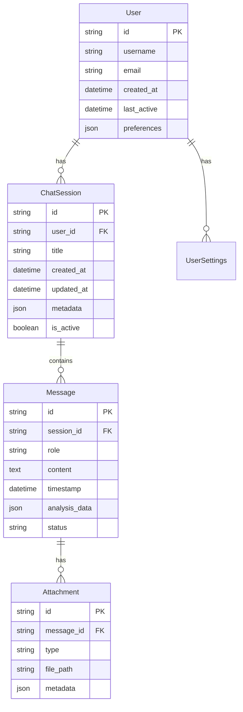

# System Architecture

This document provides a comprehensive overview of the ShopGuard chatbot architecture, including frontend, backend, and integration patterns.

## Architecture Overview

ShopGuard follows a modern three-tier architecture optimized for mobile Quick App deployment:


## Frontend Architecture

### Quick App Structure

The frontend follows Quick App framework conventions with a modular design:

```
src/
├── app.ux                 # Application entry point
├── manifest.json          # App configuration
├── pages/                 # Page components
│   ├── chat/             # Main chat interface
│   │   ├── index.ux      # Chat page component
│   │   ├── chat.css      # Chat-specific styles
│   │   └── chat.js       # Chat logic
│   ├── settings/         # Settings page
│   └── about/            # About page
├── components/           # Reusable components
│   ├── message-bubble/   # Chat message component
│   ├── input-bar/        # Message input component
│   └── sidebar/          # Navigation sidebar
├── common/               # Shared resources
│   ├── styles/           # Global styles
│   ├── images/           # Image assets
│   └── utils/            # Utility functions
└── data/                 # Configuration and data
    ├── system-settings.js
    └── user-settings.js
```

### Component Architecture

#### Chat Manager
Handles all chat-related functionality:

```javascript
// chat-manager.js
class ChatManager {
  constructor() {
    this.messages = [];
    this.isConnected = false;
    this.apiClient = new APIClient();
    this.messageQueue = [];
  }
  
  async sendMessage(content, type = 'text') {
    const message = {
      id: this.generateId(),
      role: 'user',
      content,
      type,
      timestamp: Date.now(),
      status: 'sending'
    };
    
    this.addMessage(message);
    
    try {
      const response = await this.apiClient.sendMessage(content);
      this.handleResponse(response, message.id);
    } catch (error) {
      this.handleError(error, message.id);
    }
  }
  
  addMessage(message) {
    this.messages.push(message);
    this.notifyObservers('messageAdded', message);
  }
  
  // Observer pattern for UI updates
  subscribe(callback) {
    this.observers.push(callback);
  }
}
```

#### State Manager
Centralized state management:

```javascript
// state-manager.js
class StateManager {
  constructor() {
    this.state = {
      user: null,
      settings: {},
      chatHistory: [],
      currentSession: null,
      ui: {
        theme: 'light',
        sidebarOpen: false,
        isLoading: false
      }
    };
    this.listeners = new Map();
  }
  
  setState(key, value) {
    const oldValue = this.state[key];
    this.state[key] = value;
    this.notifyListeners(key, value, oldValue);
    this.persistState();
  }
  
  getState(key) {
    return this.state[key];
  }
  
  subscribe(key, callback) {
    if (!this.listeners.has(key)) {
      this.listeners.set(key, []);
    }
    this.listeners.get(key).push(callback);
  }
}
```

### UI Components

#### Message Bubble Component
```xml
<!-- message-bubble.ux -->
<template>
  <div class="message-bubble {{role}}" id="{{messageId}}">
    <div class="avatar" if="{{showAvatar}}">
      <image src="{{avatarUrl}}" class="avatar-image"></image>
    </div>
    <div class="content">
      <div class="message-text">{{content}}</div>
      <div class="message-meta">
        <text class="timestamp">{{formatTime(timestamp)}}</text>
        <text class="status {{status}}" if="{{role === 'user'}}">{{statusText}}</text>
      </div>
    </div>
  </div>
</template>

<style>
.message-bubble {
  display: flex;
  margin: 12px 16px;
  max-width: 80%;
}

.message-bubble.user {
  align-self: flex-end;
  flex-direction: row-reverse;
}

.message-bubble.assistant {
  align-self: flex-start;
}

.content {
  background-color: #f0f0f0;
  border-radius: 18px;
  padding: 12px 16px;
  position: relative;
}

.message-bubble.user .content {
  background-color: #007AFF;
  color: white;
}
</style>

<script>
export default {
  props: {
    messageId: String,
    role: String,
    content: String,
    timestamp: Number,
    status: String,
    showAvatar: Boolean,
    avatarUrl: String
  },
  
  computed: {
    statusText() {
      const statusMap = {
        'sending': '发送中',
        'sent': '已发送',
        'delivered': '已送达',
        'error': '发送失败'
      };
      return statusMap[this.status] || '';
    }
  },
  
  methods: {
    formatTime(timestamp) {
      return new Date(timestamp).toLocaleTimeString('zh-CN', {
        hour: '2-digit',
        minute: '2-digit'
      });
    }
  }
}
</script>
```

## Backend Architecture

### Service Layer Design

The backend uses a microservices-inspired architecture with clear separation of concerns:

```python
# main.py - FastAPI application structure
from fastapi import FastAPI, HTTPException, Depends
from fastapi.middleware.cors import CORSMiddleware
from contextlib import asynccontextmanager

from services.chat_service import ChatService
from services.fraud_detection_service import FraudDetectionService
from services.rag_service import RAGService
from services.web_search_service import WebSearchService
from middleware.auth_middleware import verify_api_key
from middleware.rate_limit_middleware import rate_limit
from config.settings import Settings

@asynccontextmanager
async def lifespan(app: FastAPI):
    # Startup
    await initialize_services()
    yield
    # Shutdown
    await cleanup_services()

app = FastAPI(
    title="ShopGuard API",
    description="AI-powered shopping fraud detection API",
    version="1.0.0",
    lifespan=lifespan
)

# Middleware
app.add_middleware(CORSMiddleware, allow_origins=["*"])

# Services
chat_service = ChatService()
fraud_service = FraudDetectionService()
rag_service = RAGService()
search_service = WebSearchService()
```

### Chat Service
Core conversational AI functionality:

```python
# services/chat_service.py
from typing import List, AsyncGenerator
import asyncio
from openai import AsyncOpenAI

class ChatService:
    def __init__(self):
        self.client = AsyncOpenAI(
            api_key=settings.VIVO_API_KEY,
            base_url=settings.VIVO_API_BASE
        )
        self.active_sessions = {}
    
    async def create_completion(
        self,
        messages: List[dict],
        model: str = "vivo-BlueLM-TB-Pro",
        stream: bool = False,
        **kwargs
    ):
        """Create chat completion with fraud detection enhancement"""
        
        # Enhance messages with context if fraud-related
        enhanced_messages = await self._enhance_messages(messages)
        
        if stream:
            return self._create_stream_completion(enhanced_messages, model, **kwargs)
        else:
            return await self._create_standard_completion(enhanced_messages, model, **kwargs)
    
    async def _enhance_messages(self, messages: List[dict]) -> List[dict]:
        """Enhance messages with relevant context"""
        
        # Check if fraud detection is needed
        user_message = next((m for m in reversed(messages) if m["role"] == "user"), None)
        if not user_message:
            return messages
        
        # Add fraud detection context
        if self._is_fraud_related_query(user_message["content"]):
            system_prompt = self._get_fraud_detection_prompt()
            
            # Add or update system message
            enhanced = messages.copy()
            if enhanced and enhanced[0]["role"] == "system":
                enhanced[0]["content"] += "\n\n" + system_prompt
            else:
                enhanced.insert(0, {"role": "system", "content": system_prompt})
            
            return enhanced
        
        return messages
    
    def _is_fraud_related_query(self, content: str) -> bool:
        """Detect if query is related to fraud/shopping analysis"""
        fraud_keywords = [
            "deal", "price", "discount", "seller", "scam", "fraud",
            "legitimate", "trustworthy", "suspicious", "fake",
            "shopping", "buy", "purchase", "投资", "理财", "购物"
        ]
        return any(keyword in content.lower() for keyword in fraud_keywords)
```

### Fraud Detection Service
Specialized fraud analysis capabilities:

```python
# services/fraud_detection_service.py
from dataclasses import dataclass
from typing import Dict, List, Optional
import re
import asyncio

@dataclass
class FraudAnalysis:
    risk_level: int  # 0-10 stars
    confidence: float
    risk_factors: List[str]
    price_analysis: Optional[Dict]
    seller_analysis: Optional[Dict]
    recommendation: str

class FraudDetectionService:
    def __init__(self, rag_service, web_search_service):
        self.rag_service = rag_service
        self.web_search_service = web_search_service
        self.price_analyzer = PriceAnalyzer()
        self.url_analyzer = URLAnalyzer()
    
    async def analyze_query(self, query: str, context: Dict = None) -> FraudAnalysis:
        """Comprehensive fraud analysis of user query"""
        
        # Parallel analysis tasks
        tasks = [
            self._extract_entities(query),
            self._get_relevant_knowledge(query),
            self._analyze_pricing(query),
            self._analyze_urls(query)
        ]
        
        # Execute analysis tasks concurrently
        entities, knowledge, price_analysis, url_analysis = await asyncio.gather(*tasks)
        
        # Synthesize results
        risk_factors = []
        risk_score = 0
        
        # Price-based risk assessment
        if price_analysis:
            if price_analysis.get("suspiciously_low", False):
                risk_factors.append("Abnormally low price")
                risk_score += 3
        
        # URL-based risk assessment
        if url_analysis:
            if url_analysis.get("domain_reputation", 0) < 0.3:
                risk_factors.append("Untrustworthy domain")
                risk_score += 2
        
        # Knowledge-based risk assessment
        if knowledge:
            similar_scams = len([k for k in knowledge if k.get("is_scam", False)])
            if similar_scams > 0:
                risk_factors.append(f"Similar to {similar_scams} known scam patterns")
                risk_score += similar_scams
        
        # Generate recommendation
        recommendation = self._generate_recommendation(risk_score, risk_factors)
        
        return FraudAnalysis(
            risk_level=min(10, risk_score),
            confidence=0.8,  # Calculate based on data quality
            risk_factors=risk_factors,
            price_analysis=price_analysis,
            seller_analysis=None,  # TODO: Implement seller analysis
            recommendation=recommendation
        )
```

### RAG System Architecture
Retrieval-Augmented Generation for enhanced knowledge:

```python
# services/rag_service.py
import chromadb
from sentence_transformers import SentenceTransformer
from typing import List, Dict

class RAGService:
    def __init__(self):
        self.client = chromadb.PersistentClient(path="./chroma_db")
        self.collection = self.client.get_or_create_collection(
            name="fraud_knowledge",
            metadata={"hnsw:space": "cosine"}
        )
        self.encoder = SentenceTransformer('m3e-base')
        
    async def retrieve_relevant_knowledge(
        self, 
        query: str, 
        max_results: int = 5,
        similarity_threshold: float = 0.7
    ) -> List[Dict]:
        """Retrieve relevant fraud cases and knowledge"""
        
        # Generate query embedding
        query_embedding = self.encoder.encode([query])
        
        # Search similar documents
        results = self.collection.query(
            query_embeddings=query_embedding.tolist(),
            n_results=max_results,
            where={"type": "fraud_case"},
            include=["documents", "metadatas", "distances"]
        )
        
        # Filter by similarity threshold
        filtered_results = []
        for i, distance in enumerate(results["distances"][0]):
            similarity = 1 - distance  # Convert distance to similarity
            if similarity >= similarity_threshold:
                filtered_results.append({
                    "content": results["documents"][0][i],
                    "metadata": results["metadatas"][0][i],
                    "similarity": similarity
                })
        
        return filtered_results
    
    async def add_knowledge(self, documents: List[str], metadatas: List[Dict]):
        """Add new knowledge to the database"""
        
        # Generate embeddings
        embeddings = self.encoder.encode(documents)
        
        # Generate unique IDs
        ids = [f"doc_{i}_{hash(doc)}" for i, doc in enumerate(documents)]
        
        # Add to collection
        self.collection.add(
            documents=documents,
            metadatas=metadatas,
            embeddings=embeddings.tolist(),
            ids=ids
        )
```

## Data Architecture

### Database Design



### Configuration Management

```python
# config/settings.py
from pydantic import BaseSettings, validator
from typing import List, Optional

class Settings(BaseSettings):
    # API Configuration
    API_HOST: str = "localhost"
    API_PORT: int = 8000
    API_KEY: str = "default-key"
    
    # vivo BlueLM Configuration
    VIVO_API_KEY: str
    VIVO_API_BASE: str = "https://api.vivo.ai"
    VIVO_MODEL_TB_PRO: str = "vivo-BlueLM-TB-Pro"
    VIVO_MODEL_VISION: str = "vivo-BlueLM-V-2.0"
    
    # Database Configuration
    DATABASE_URL: str = "sqlite:///./shopguard.db"
    CHROMA_PERSIST_DIR: str = "./chroma_db"
    
    # RAG Configuration
    RAG_ENABLED: bool = True
    EMBEDDING_MODEL: str = "m3e-base"
    MAX_RETRIEVALS: int = 5
    SIMILARITY_THRESHOLD: float = 0.7
    
    # Search Configuration
    SEARCH_ENABLED: bool = True
    SEARCH_TIMEOUT: int = 5
    GOOGLE_API_KEY: Optional[str] = None
    BING_API_KEY: Optional[str] = None
    
    # Performance Configuration
    MAX_WORKERS: int = 4
    REQUEST_TIMEOUT: int = 30
    RATE_LIMIT_PER_MINUTE: int = 100
    CACHE_TTL: int = 3600
    
    # Security Configuration
    CORS_ORIGINS: List[str] = ["*"]
    API_KEY_REQUIRED: bool = True
    
    @validator('VIVO_API_KEY')
    def vivo_api_key_required(cls, v):
        if not v:
            raise ValueError('VIVO_API_KEY is required')
        return v
    
    class Config:
        env_file = ".env"
        case_sensitive = True

settings = Settings()
```

## Security Architecture

### Authentication & Authorization

```python
# middleware/auth_middleware.py
from fastapi import HTTPException, Security
from fastapi.security import HTTPBearer, HTTPAuthorizationCredentials
from typing import Optional

security = HTTPBearer()

async def verify_api_key(
    credentials: HTTPAuthorizationCredentials = Security(security)
) -> str:
    """Verify API key from request headers"""
    
    if not credentials:
        raise HTTPException(
            status_code=401,
            detail="Missing authentication credentials"
        )
    
    api_key = credentials.credentials
    
    # Validate API key
    if not is_valid_api_key(api_key):
        raise HTTPException(
            status_code=401,
            detail="Invalid API key"
        )
    
    return api_key

def is_valid_api_key(api_key: str) -> bool:
    """Validate API key against configured keys"""
    valid_keys = settings.VALID_API_KEYS.split(',')
    return api_key in valid_keys
```

### Rate Limiting

```python
# middleware/rate_limit_middleware.py
import time
from collections import defaultdict
from fastapi import HTTPException, Request
from typing import Dict

class RateLimiter:
    def __init__(self, requests_per_minute: int = 60):
        self.requests_per_minute = requests_per_minute
        self.clients: Dict[str, List[float]] = defaultdict(list)
    
    def is_allowed(self, client_id: str) -> bool:
        """Check if client is within rate limits"""
        now = time.time()
        minute_ago = now - 60
        
        # Clean old requests
        self.clients[client_id] = [
            timestamp for timestamp in self.clients[client_id]
            if timestamp > minute_ago
        ]
        
        # Check if under limit
        if len(self.clients[client_id]) >= self.requests_per_minute:
            return False
        
        # Record this request
        self.clients[client_id].append(now)
        return True

rate_limiter = RateLimiter(settings.RATE_LIMIT_PER_MINUTE)

async def rate_limit_middleware(request: Request, call_next):
    """Rate limiting middleware"""
    client_ip = request.client.host
    
    if not rate_limiter.is_allowed(client_ip):
        raise HTTPException(
            status_code=429,
            detail="Rate limit exceeded"
        )
    
    response = await call_next(request)
    return response
```

## Deployment Architecture

### Container Setup

```dockerfile
# Dockerfile
FROM python:3.9-slim

WORKDIR /app

# Install system dependencies
RUN apt-get update && apt-get install -y \
    gcc \
    g++ \
    && rm -rf /var/lib/apt/lists/*

# Install Python dependencies
COPY requirements.txt .
RUN pip install --no-cache-dir -r requirements.txt

# Copy application code
COPY . .

# Create non-root user
RUN useradd --create-home --shell /bin/bash app
USER app

# Expose port
EXPOSE 8000

# Health check
HEALTHCHECK --interval=30s --timeout=10s --start-period=5s --retries=3 \
    CMD curl -f http://localhost:8000/health || exit 1

# Start application
CMD ["uvicorn", "main:app", "--host", "0.0.0.0", "--port", "8000"]
```

### Kubernetes Deployment

```yaml
# deployment.yaml
apiVersion: apps/v1
kind: Deployment
metadata:
  name: shopguard-api
spec:
  replicas: 3
  selector:
    matchLabels:
      app: shopguard-api
  template:
    metadata:
      labels:
        app: shopguard-api
    spec:
      containers:
      - name: api
        image: shopguard/api:latest
        ports:
        - containerPort: 8000
        env:
        - name: API_KEY
          valueFrom:
            secretKeyRef:
              name: shopguard-secrets
              key: api-key
        resources:
          requests:
            memory: "512Mi"
            cpu: "250m"
          limits:
            memory: "1Gi"
            cpu: "500m"
        livenessProbe:
          httpGet:
            path: /health
            port: 8000
          initialDelaySeconds: 30
          periodSeconds: 10
        readinessProbe:
          httpGet:
            path: /ready
            port: 8000
          initialDelaySeconds: 5
          periodSeconds: 5
```

## Performance Optimization

### Caching Strategy

```python
# services/cache_service.py
import redis
import json
from typing import Any, Optional
from functools import wraps

class CacheService:
    def __init__(self):
        self.redis_client = redis.Redis(
            host=settings.REDIS_HOST,
            port=settings.REDIS_PORT,
            db=0,
            decode_responses=True
        )
    
    def cache_result(self, key_prefix: str, ttl: int = 3600):
        """Decorator to cache function results"""
        def decorator(func):
            @wraps(func)
            async def wrapper(*args, **kwargs):
                # Generate cache key
                cache_key = f"{key_prefix}:{hash(str(args) + str(kwargs))}"
                
                # Try to get from cache
                cached = self.get(cache_key)
                if cached is not None:
                    return cached
                
                # Execute function and cache result
                result = await func(*args, **kwargs)
                self.set(cache_key, result, ttl)
                
                return result
            return wrapper
        return decorator
    
    def set(self, key: str, value: Any, ttl: int = 3600):
        """Set value in cache"""
        self.redis_client.setex(
            key, 
            ttl, 
            json.dumps(value, default=str)
        )
    
    def get(self, key: str) -> Optional[Any]:
        """Get value from cache"""
        cached = self.redis_client.get(key)
        if cached:
            return json.loads(cached)
        return None

cache_service = CacheService()
```

## Monitoring and Observability

### Metrics Collection

```python
# monitoring/metrics.py
from prometheus_client import Counter, Histogram, Gauge
import time
from functools import wraps

# Define metrics
REQUEST_COUNT = Counter(
    'http_requests_total',
    'Total HTTP requests',
    ['method', 'endpoint', 'status']
)

REQUEST_DURATION = Histogram(
    'http_request_duration_seconds',
    'HTTP request duration'
)

ACTIVE_SESSIONS = Gauge(
    'active_chat_sessions',
    'Number of active chat sessions'
)

FRAUD_DETECTIONS = Counter(
    'fraud_detections_total',
    'Total fraud detections',
    ['risk_level']
)

def monitor_requests(func):
    """Decorator to monitor API requests"""
    @wraps(func)
    async def wrapper(request, *args, **kwargs):
        start_time = time.time()
        
        try:
            response = await func(request, *args, **kwargs)
            status = getattr(response, 'status_code', 200)
            
            # Record metrics
            REQUEST_COUNT.labels(
                method=request.method,
                endpoint=request.url.path,
                status=status
            ).inc()
            
            REQUEST_DURATION.observe(time.time() - start_time)
            
            return response
            
        except Exception as e:
            REQUEST_COUNT.labels(
                method=request.method,
                endpoint=request.url.path,
                status=500
            ).inc()
            raise e
    
    return wrapper
```

This architecture provides a solid foundation for building and scaling the ShopGuard chatbot application. The modular design allows for easy maintenance and feature expansion while maintaining high performance and reliability.

## Next Steps

- **[UI Design Guide](ui-design.md)**: Detailed interface design patterns
- **[Core Features](core-features.md)**: Implementation of key functionality
- **[Performance Optimization](performance.md)**: Advanced optimization techniques
