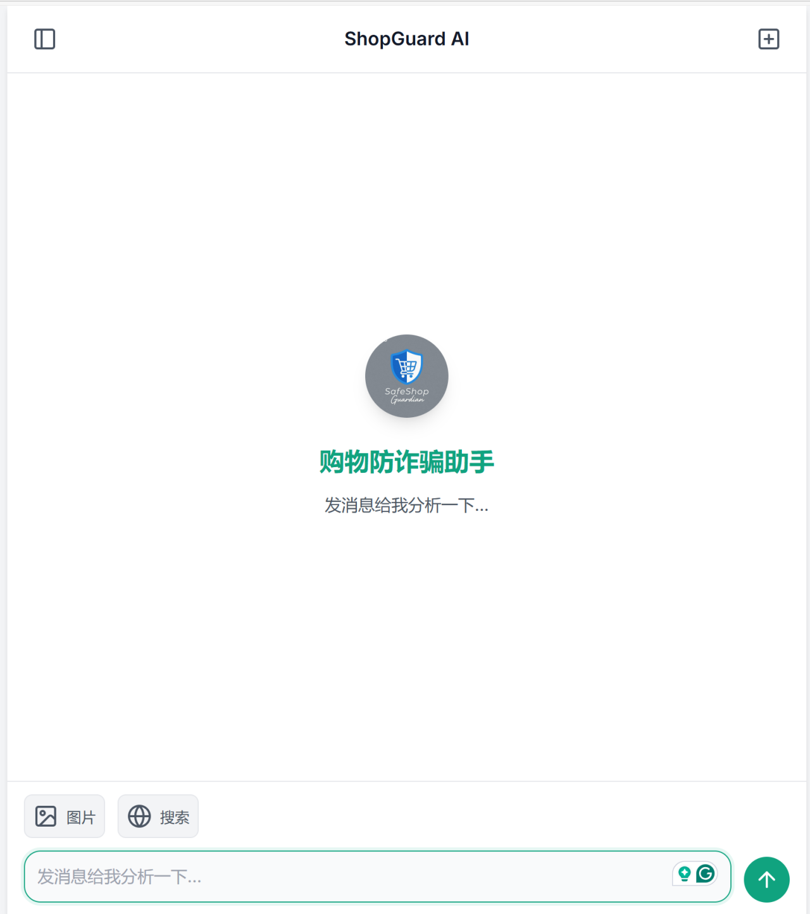
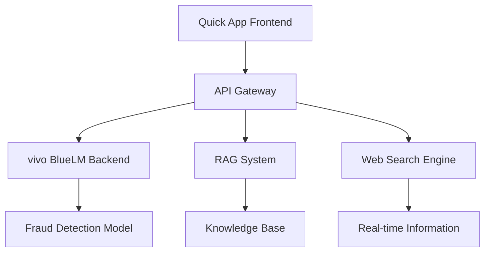

# ShopGuard Chatbot Documentation

Welcome to the comprehensive documentation for ShopGuard AI chatbot - an intelligent shopping fraud prevention assistant built using Quick App framework.

## What is ShopGuard?

ShopGuard is an AI-powered chatbot designed to protect users from online shopping fraud. It combines the ease of web development with native app performance using the Quick App framework, making it accessible to developers with HTML, CSS, and JavaScript knowledge.

## Key Features

- **🛡️ Fraud Detection**: Intelligent analysis of shopping links, prices, and seller information
- **💬 Natural Conversation**: Powered by vivo BlueLM AI model with OpenAI-compatible API
- **📱 Modern UI**: Sleek interface inspired by popular chat applications
- **🚀 Quick App Framework**: No installation required, instant access
- **🔧 Easy Development**: Built with familiar web technologies

## Quick Navigation

### 🚀 [Getting Started](getting-started/overview.md)
New to ShopGuard? Start here to understand the project structure and set up your development environment.

### 💻 [Development Guide](development/architecture.md)
Detailed guides for implementing core features, UI design patterns, and performance optimization.

### 📚 [API Reference](api/overview.md)
Complete API documentation including backend services, OpenAI compatibility layer, and usage examples.

### 🚢 [Deployment](deployment/build.md)
Learn how to build, package, and deploy your ShopGuard chatbot to production.

### 📖 [Tutorials](tutorials/basic-chat.md)
Step-by-step tutorials for implementing specific features and customizations.

## Architecture Overview

## Technology Stack

- **Frontend**: Quick App (HTML, CSS, JavaScript)
- **Backend**: FastAPI + Python
- **AI Model**: vivo BlueLM
- **Vector Database**: Chroma
- **Search**: Multiple search engines integration
- **API**: OpenAI-compatible format

## Community & Support

- **GitHub**: [Repository Link](https://github.com/your-username/shopguard-chatbot)
- **Issues**: [Report Issues](https://github.com/your-username/shopguard-chatbot/issues)
- **Discussions**: [Community Discussions](https://github.com/your-username/shopguard-chatbot/discussions)

## License

This project is licensed under the MIT License - see the [LICENSE](https://github.com/your-username/shopguard-chatbot/blob/main/LICENSE) file for details.

---

*Last updated: {{ git.date.strftime('%B %d, %Y') }}*
