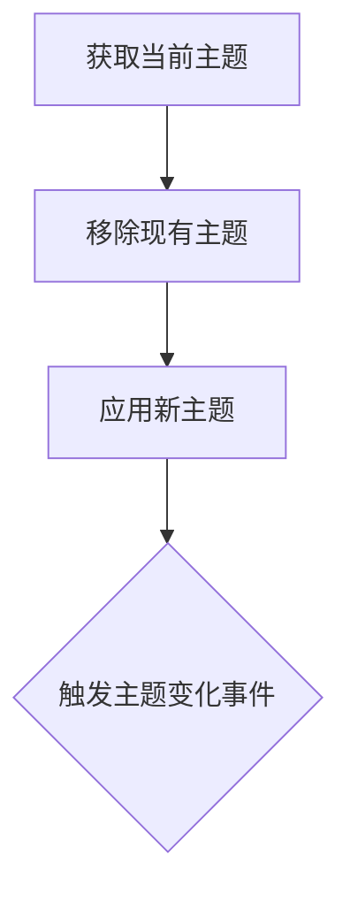
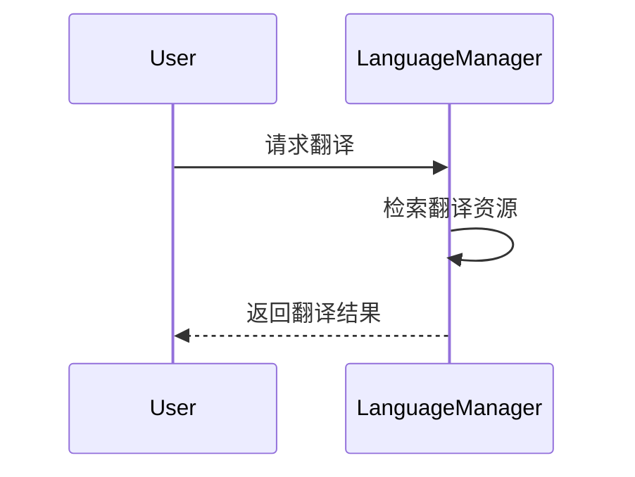
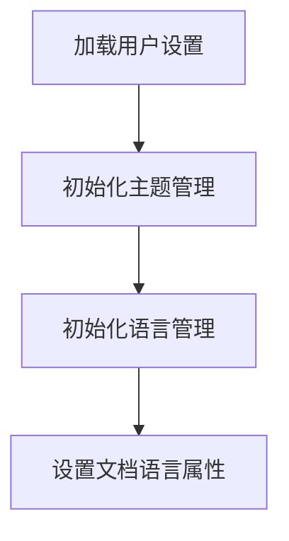
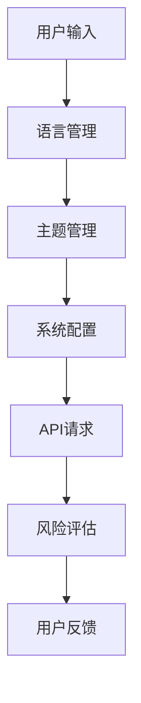
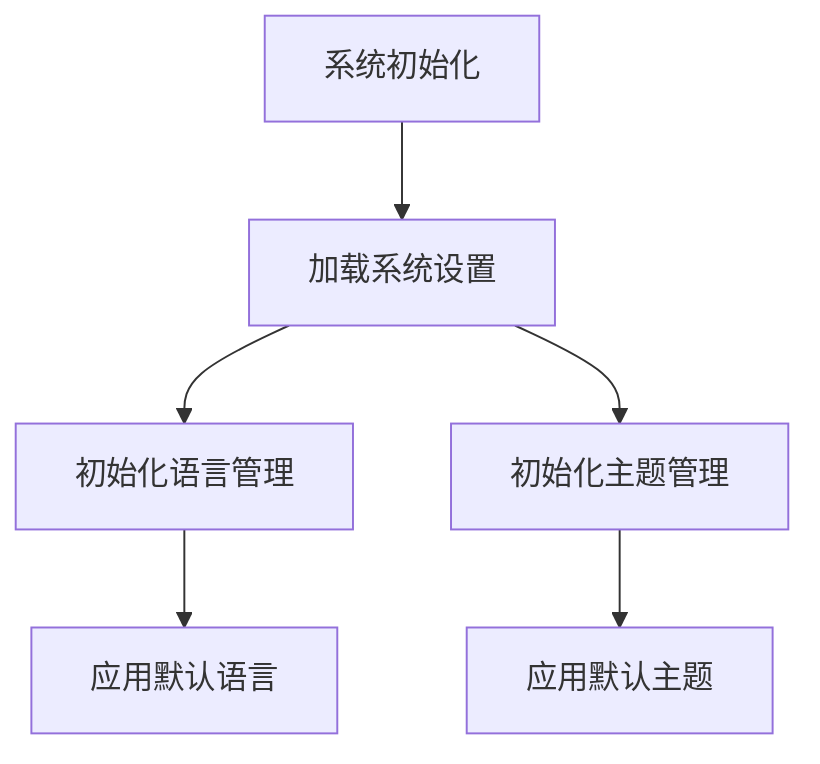
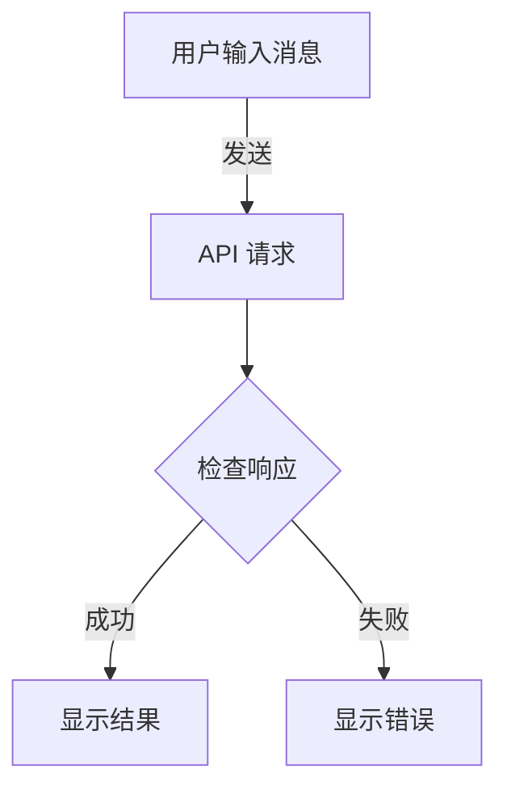
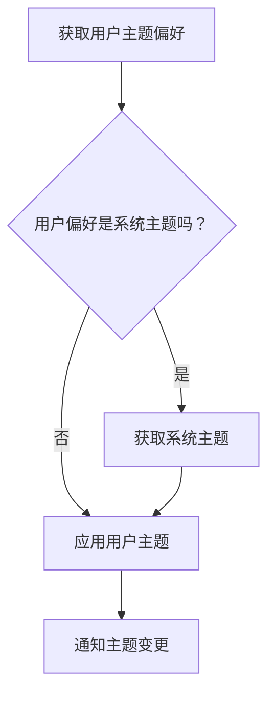
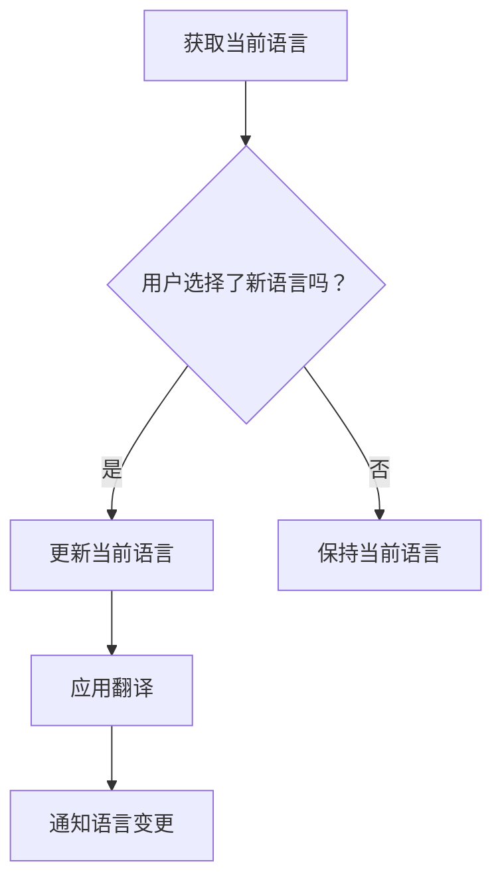
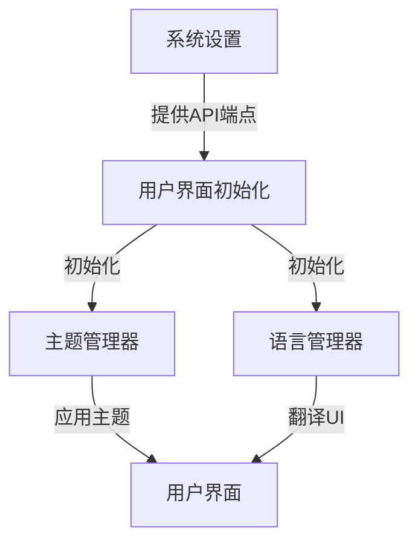

# Wiki Documentation for /home/krisspy/mydesk/coding/myOpenSource/shopguard-chatbot

Generated on: 2025-07-02 17:23:25

## Table of Contents

- [项目概览](#page-1)
- [系统架构概述](#page-2)
- [主要功能](#page-3)
- [风险评级与建议](#page-4)
- [数据管理与流程](#page-5)
- [主页组件](#page-6)
- [设置页面](#page-7)
- [后端系统](#page-8)
- [模型集成](#page-9)
- [部署与基础设施](#page-10)
- [扩展性与自定义](#page-11)

<a id='page-1'></a>

## 项目概览

### Related Pages

Related topics: [系统架构概述](#page-2), [主要功能](#page-3)

<details>
<summary>Relevant source files</summary>

- [README.md](README.md)
- [src/data/system-settings.js](src/data/system-settings.js)
- [src/homepage.html](src/homepage.html)
- [src/js/theme-manager.js](src/js/theme-manager.js)
- [src/data/language-manager.js](src/data/language-manager.js)
</details>

# 项目概览

BlueLM Shopguard 是一个购物防诈骗助手项目，旨在通过人工智能帮助用户识别潜在的购物诈骗风险。该项目的核心功能包括聊天分析、图片上传分析以及多语言支持。本文档详细介绍了项目的架构、关键组件及其配置。

## 系统架构

项目采用模块化设计，主要包括以下几个核心模块：

- **数据管理模块**：负责系统和用户设置的存储与管理。
- **界面管理模块**：处理主题和语言的切换。
- **功能模块**：实现聊天和图片分析功能。

### 数据管理模块

数据管理模块负责存储和管理系统配置及用户偏好设置。

#### 系统设置

系统设置定义了 API 端点、模型、功能开关等关键配置项。

```javascript
export let SystemSettings = {
  api: {
    endpoint: "http://localhost:8000/v1/chat/completions",
    model: "vivo-BlueLM-TB-Pro",
    timeout: 30000, // 30秒
    maxRetries: 3,
  },
  features: {
    webSearch: true,
    fileUpload: true,
    chatHistory: true,
  },
  chat: {
    welcomeMessage: '遇到可疑商品、卖家或付款方式？随时发给我分析...',
    errorMessage: "抱歉，服务暂时不可用，请稍后再试。",
  },
};
```
Sources: [src/data/system-settings.js:48-75]()

#### 用户设置

用户设置模块用于管理用户的主题和语言偏好，这些设置会自动保存到 `localStorage`。

### 界面管理模块

界面管理模块提供主题和语言的切换功能，确保应用界面与用户偏好一致。

#### 主题管理

主题管理通过 `theme-manager.js` 实现，支持浅色、深色和系统默认主题。

```javascript
applyTheme() {
  const theme = this.getCurrentTheme();
  const html = document.documentElement;
  html.setAttribute("data-theme", theme);
  document.dispatchEvent(new CustomEvent("themechange", { detail: { theme } }));
}
```
Sources: [src/js/theme-manager.js:2-16]()

#### 语言管理

语言管理支持中英文切换，通过 `language-manager.js` 实现。

```javascript
translate(key, params = {}) {
  const resources = this.languages[this.currentLanguage];
  const translation = resources[key];
  return translation ? this.interpolate(translation, params) : key;
}
```
Sources: [src/data/language-manager.js:65-84]()

## 功能模块

功能模块主要实现聊天分析和图片上传分析功能。

### 聊天分析

用户可以通过发送消息与系统交互，系统会返回风险分析结果。

### 图片上传分析

支持用户上传图片进行风险分析，通过文件读取和预览功能实现。

```javascript
elements.imageUploadButton.addEventListener('click', () => {
  const input = document.createElement('input');
  input.type = 'file';
  input.accept = 'image/*';
  input.onchange = () => {
    const file = input.files[0];
    if (!file.type.startsWith('image/')) {
      showErrorNotification('请选择图片文件');
      return;
    }
    const reader = new FileReader();
    reader.onload = (e) => {
      state.currentImageData = e.target.result;
      elements.previewImage.src = state.currentImageData;
      elements.imagePreviewContainer.style.display = 'block';
    };
    reader.readAsDataURL(file);
  };
  input.click();
});
```
Sources: [src/homepage.html:188-212]()

## 配置与使用

项目的配置文件位于 `src/data/system-settings.js`，用户可根据需求调整 API 端点、模型等配置。用户设置会自动保存到浏览器的 `localStorage`，确保下次访问时能够恢复用户偏好。

## 总结

BlueLM Shopguard 项目通过模块化设计，实现了购物防诈骗的核心功能。系统设置和用户偏好管理确保了应用的灵活性和用户体验的一致性。未来的开发将继续完善快应用的支持和更多功能的实现。

---

<a id='page-2'></a>

## 系统架构概述

### Related Pages

Related topics: [数据管理与流程](#page-5)

<details>
<summary>Relevant source files</summary>

- [src/data/system-settings.js](src/data/system-settings.js)
- [README.md](README.md)
- [src/homepage.html](src/homepage.html)
- [src/js/theme-manager.js](src/js/theme-manager.js)
- [src/data/language-manager.js](src/data/language-manager.js)
</details>

# 系统架构概述

## 简介

BlueLM Shopguard 是一款旨在帮助用户识别潜在购物诈骗的人工智能助手。本系统架构文档概述了该项目的核心组件、数据流和关键功能。系统的设计目标是提供一个可扩展且易于维护的平台，以支持不同的应用场景和用户需求。

## 系统配置

系统配置由 `src/data/system-settings.js` 文件定义，提供了 API 配置、应用程序设置、功能开关以及聊天设置等信息。

```javascript
export let SystemSettings = {
  api: {
    endpoint: "http://localhost:8000/v1/chat/completions",
    model: "vivo-BlueLM-TB-Pro",
    timeout: 30000,
    maxRetries: 3,
  },
  app: {
    name: "BlueLM Shopguard",
    version: "1.0.0",
    environment: "development",
  },
  features: {
    webSearch: true,
    fileUpload: true,
    chatHistory: true,
  },
  chat: {
    welcomeMessage: '遇到可疑商品、卖家或付款方式？随时发给我分析。',
    errorMessage: "抱歉，服务暂时不可用，请稍后再试。",
  },
};
```
Sources: [src/data/system-settings.js:40-61]()

## 主题管理

主题管理由 `src/js/theme-manager.js` 负责，主要功能包括应用用户首选的主题以及监听系统主题的变化。

```javascript
applyTheme() {
  const theme = this.getCurrentTheme();
  const html = document.documentElement;
  html.removeAttribute("data-theme");
  html.setAttribute("data-theme", theme);
  document.dispatchEvent(
    new CustomEvent("themechange", { detail: { theme } })
  );
}
```
Sources: [src/js/theme-manager.js:4-14]()

### 主题应用流程


Sources: [src/js/theme-manager.js:4-14]()

## 语言管理

语言管理模块定义在 `src/data/language-manager.js` 中，负责加载和应用多语言支持。

```javascript
translate(key, params = {}) {
  const resources = this.languages[this.currentLanguage];
  const translation = resources[key];
  return translation || key;
}
```
Sources: [src/data/language-manager.js:50-68]()

### 语言翻译流程


Sources: [src/data/language-manager.js:50-68]()

## 前端页面

前端页面主要由 `src/homepage.html` 和 `src/pages/setting.html` 组成，负责加载用户设置并初始化核心服务。

```html
<script type="module">
  import { getSystemSetting } from './data/system-settings.js';
  import { loadUserSettings } from './data/user-settings.js';
  loadUserSettings();
</script>
```
Sources: [src/homepage.html:12-21]()

### 页面加载流程


Sources: [src/homepage.html:12-21]()

## 总结

BlueLM Shopguard 系统架构通过模块化的设计，提供了灵活的配置和扩展能力。通过详细的系统设置、主题和语言管理模块，项目能够有效地支持用户个性化需求并提供无缝的用户体验。

---

<a id='page-3'></a>

## 主要功能

### Related Pages

Related topics: [风险评级与建议](#page-4)

<details>
<summary>Relevant source files</summary>

- [README.md](README.md)
- [src/data/system-settings.js](src/data/system-settings.js)
- [src/homepage.html](src/homepage.html)
- [src/js/theme-manager.js](src/js/theme-manager.js)
- [src/data/language-manager.js](src/data/language-manager.js)

</details>

# 主要功能

## 简介

"主要功能"在BlueLM Shopguard项目中扮演着至关重要的角色，旨在帮助用户识别潜在的购物诈骗。这一功能通过分析用户提供的商品截图、链接或聊天记录，评估其风险等级并提供相应的建议。系统不仅支持图片上传和多语言界面，还提供了一系列配置选项以适应不同用户的需求。

## 系统配置

系统配置是BlueLM Shopguard功能的核心部分，通过`system-settings.js`文件进行管理。配置选项包括API端点设置、功能开关以及聊天信息设置等。

```javascript
export let SystemSettings = {
  api: {
    endpoint: "http://localhost:8000/v1/chat/completions",
    model: "vivo-BlueLM-TB-Pro",
    timeout: 30000, // 30秒
    maxRetries: 3,
  },
  features: {
    webSearch: true,
    fileUpload: true,
    chatHistory: true,
  },
  chat: {
    welcomeMessage: '遇到可疑商品、卖家或付款方式？随时发给我分析。',
    errorMessage: "抱歉，服务暂时不可用，请稍后再试。",
  },
};
```
Sources: [src/data/system-settings.js:54-81]()

## 主题管理

主题管理模块通过`theme-manager.js`文件实现，负责应用用户选择的主题，并在系统主题改变时更新界面。

```javascript
applyTheme() {
  const theme = this.getCurrentTheme();
  const html = document.documentElement;

  html.removeAttribute("data-theme");
  html.setAttribute("data-theme", theme);

  document.dispatchEvent(
    new CustomEvent("themechange", { detail: { theme } })
  );
}
```
Sources: [src/js/theme-manager.js:5-17]()

## 语言管理

语言管理模块通过`language-manager.js`文件实现，支持多语言界面并根据用户的语言偏好加载相应的语言资源。

```javascript
export const languageManager = new LanguageManager();

export function t(key, params = {}) {
  return languageManager.translate(key, params);
}
```
Sources: [src/data/language-manager.js:73-78]()

## 数据流图

为了更好地理解系统的工作流程，以下是一个使用Mermaid绘制的系统数据流图。


Sources: [src/homepage.html:20-60](), [src/js/theme-manager.js:5-17](), [src/data/language-manager.js:73-78]()

## 结论

"主要功能"模块通过灵活的系统配置、主题和语言管理，确保用户能够在不同环境下高效使用BlueLM Shopguard。其核心目标是帮助用户识别和避免购物诈骗，提供了一个安全的购物体验。

---

<a id='page-4'></a>

## 风险评级与建议

### Related Pages

Related topics: [主要功能](#page-3)

<details>
<summary>Relevant source files</summary>

- [src/data/system-settings.js](src/data/system-settings.js)
- [README.md](README.md)
- [src/homepage.html](src/homepage.html)
- [src/data/i18n/zh-CN.js](src/data/i18n/zh-CN.js)
- [src/js/theme-manager.js](src/js/theme-manager.js)
</details>

# 风险评级与建议

## 简介

在BlueLM Shopguard项目中，“风险评级与建议”模块旨在帮助用户识别和分析潜在的购物诈骗风险。通过分析商品信息、卖家行为和支付方式，该模块为用户提供明确的风险评级和相应的建议，以确保用户能够安全购物。该模块与系统设置、用户界面和语言管理等其他模块紧密集成，确保为用户提供一致且有效的防诈骗体验。

## 系统设置

系统设置模块在整个应用程序中起着核心作用，定义了API端点、模型选择、功能开关以及用户界面信息等配置。此模块允许动态获取和更新设置，从而支持灵活的系统配置。

```javascript
export let SystemSettings = {
  api: {
    endpoint: "http://localhost:8000/v1/chat/completions",
    model: "vivo-BlueLM-TB-Pro",
    timeout: 30000, // 30秒
    maxRetries: 3,
  },
  features: {
    webSearch: true,
    fileUpload: true,
    chatHistory: true,
  },
  chat: {
    welcomeMessage: '遇到可疑商品、卖家或付款方式？随时发给我分析。',
    errorMessage: "抱歉，服务暂时不可用，请稍后再试。",
  },
};
```
Sources: [src/data/system-settings.js:40-58]()

### 配置选项表

| 配置项              | 类型     | 默认值                           | 描述                       |
|-------------------|--------|-------------------------------|--------------------------|
| api.endpoint      | 字符串   | "http://localhost:8000/v1/chat/completions" | API端点URL                 |
| api.model         | 字符串   | "vivo-BlueLM-TB-Pro"          | 使用的模型名称                |
| api.timeout       | 数字     | 30000                         | API请求超时时间（毫秒）          |
| features.webSearch | 布尔值   | true                          | 是否启用网页搜索               |

## 用户界面

用户界面模块通过HTML和CSS实现，提供直观的用户交互体验。在此模块中，用户可以上传图片、发送消息并接收风险分析结果。

```html
<div class="sidebar-overlay" role="presentation"></div>
<aside class="sidebar" role="complementary" aria-label="Conversation History">
    <header class="sidebar__header">
        <h2 class="sidebar__title" data-i18n="home.history.title">历史对话</h2>
        <button class="header-button close-sidebar-button" aria-label="Close sidebar">
            <i data-lucide="x"></i>
        </button>
    </header>
    <div class="sidebar__content">
        <!-- Conversation history will be implemented later -->
    </div>
</aside>
```
Sources: [src/homepage.html:30-45]()

## 语言管理

语言管理模块负责应用程序的多语言支持，通过i18n文件提供不同语言的UI文本翻译。当前支持的语言包括中文和英文。

```javascript
export default {
  "app.name": "BlueLM Shopguard",
  "app.title": "BlueLM Shopguard - 购物防诈骗助手",
  "app.description": "购物防诈骗助手",
  "home.welcome": "欢迎使用 BlueLM Shopguard",
  "home.subtitle": "您的购物防诈骗助手",
  // 更多翻译条目...
};
```
Sources: [src/data/i18n/zh-CN.js:4-16]()

## 主题管理

主题管理模块允许用户根据个人偏好或系统设置选择应用程序的外观模式（浅色、深色或系统默认）。该模块通过localStorage保存用户的主题偏好设置。

```javascript
applyTheme() {
  const theme = this.getCurrentTheme();
  const html = document.documentElement;
  html.removeAttribute("data-theme");
  html.setAttribute("data-theme", theme);
  document.dispatchEvent(new CustomEvent("themechange", { detail: { theme } }));
}
```
Sources: [src/js/theme-manager.js:2-15]()

## 总结

“风险评级与建议”模块通过与系统设置、用户界面和语言管理模块的集成，为用户提供了一个安全且用户友好的购物体验。该模块不仅识别和分析购物风险，还为用户提供了明确的建议，帮助他们做出明智的购物决策。在BlueLM Shopguard的整体架构中，该模块是确保用户安全购物的关键组件。

---

<a id='page-5'></a>

## 数据管理与流程

### Related Pages

Related topics: [系统架构概述](#page-2)

<details>
<summary>Relevant source files</summary>

- [src/data/system-settings.js](src/data/system-settings.js)
- [src/homepage.html](src/homepage.html)
- [src/js/theme-manager.js](src/js/theme-manager.js)
- [src/data/i18n/zh-CN.js](src/data/i18n/zh-CN.js)
- [src/data/language-manager.js](src/data/language-manager.js)
</details>

# 数据管理与流程

## 简介

在“BlueLM Shopguard”项目中，数据管理与流程涉及到系统设置、用户界面语言管理、主题管理等关键模块。这些模块的协同工作为应用程序提供了灵活的配置和用户友好的界面体验。本文档将深入探讨这些模块的架构、数据流以及相关功能的实现。

## 系统设置

系统设置模块提供了应用程序的核心配置，包括API端点、功能开关和用户界面信息。

### 系统配置

系统配置通过`SystemSettings`对象进行管理，包含API设置、应用程序设置和功能开关等。

```javascript
export let SystemSettings = {
  api: {
    endpoint: "http://localhost:8000/v1/chat/completions",
    model: "vivo-BlueLM-TB-Pro",
    timeout: 30000,
    maxRetries: 3,
  },
  app: {
    name: "BlueLM Shopguard",
    version: "1.0.0",
    environment: "development",
  },
  features: {
    webSearch: true,
    fileUpload: true,
    chatHistory: true,
  },
  chat: {
    welcomeMessage: '遇到可疑商品、卖家或付款方式？随时发给我分析。',
    errorMessage: "抱歉，服务暂时不可用，请稍后再试。",
  },
};
```
Sources: [src/data/system-settings.js:1-36]()

### 获取与设置系统配置

系统配置模块提供了`getSystemSetting`和`setSystemSetting`函数，用于获取和设置配置参数。

```javascript
export function getSystemSetting(key) {
  if (!key) return undefined;
  const keys = key.split(".");
  let result = SystemSettings;
  for (const k of keys) {
    if (result === undefined || result === null || typeof result !== "object") {
      return undefined;
    }
    result = result[k];
  }
  return result;
}
```
Sources: [src/data/system-settings.js:38-51]()

## 语言管理

语言管理模块负责应用程序的多语言支持，允许用户在不同语言之间切换。

### 语言资源

应用程序使用JSON格式的语言资源文件来管理UI字符串。以下是中文语言资源的示例：

```javascript
export default {
  "app.name": "BlueLM Shopguard",
  "nav.home": "首页",
  "settings.title": "设置",
  "home.welcome": "欢迎使用 BlueLM Shopguard",
  // 更多键值对...
};
```
Sources: [src/data/i18n/zh-CN.js:1-34]()

### 语言切换

语言管理器负责处理语言切换，使用`translate`方法根据当前语言返回对应的翻译。

```javascript
translate(key, params = {}) {
  if (!key) return "";
  const resources = this.languages[this.currentLanguage];
  const translation = resources[key];
  return translation || key;
}
```
Sources: [src/data/language-manager.js:52-74]()

## 主题管理

主题管理模块允许用户在不同的外观模式之间切换（例如，浅色模式和深色模式）。

### 主题应用

`themeManager`对象通过`applyTheme`方法应用用户选择的主题。

```javascript
applyTheme() {
  const theme = this.getCurrentTheme();
  const html = document.documentElement;
  html.removeAttribute("data-theme");
  html.setAttribute("data-theme", theme);
  document.dispatchEvent(new CustomEvent("themechange", { detail: { theme } }));
}
```
Sources: [src/js/theme-manager.js:1-13]()

## 数据流与交互

以下Mermaid图展示了系统设置、语言管理和主题管理之间的交互流程：


Sources: [src/homepage.html:11-81]()

## 总结

“BlueLM Shopguard”项目的“数据管理与流程”模块通过系统设置、语言管理和主题管理，提供了灵活的配置和用户友好的界面体验。这些模块的协同工作确保了应用程序的可配置性和易用性。

---

<a id='page-6'></a>

## 主页组件

### Related Pages

Related topics: [设置页面](#page-7)

<details>
<summary>Relevant source files</summary>

- [src/homepage.html](src/homepage.html)
- [src/data/system-settings.js](src/data/system-settings.js)
- [src/js/theme-manager.js](src/js/theme-manager.js)
- [src/data/user-settings.js](src/data/user-settings.js)
- [src/data/i18n/zh-CN.js](src/data/i18n/zh-CN.js)
</details>

# 主页组件

## 简介

主页组件是 BlueLM Shopguard 项目中的核心模块之一，负责提供用户界面和交互功能。该组件支持用户进行聊天、上传图片以及查看历史对话。主页组件集成了系统设置、用户设置和语言管理等功能，以确保用户在不同环境中的一致体验。此组件的设计旨在帮助用户识别购物中的潜在风险，通过用户友好的界面提供防诈骗分析服务。

## 组件结构

### 页面结构

主页组件的 HTML 结构主要由导航栏、侧边栏和内容区域组成。导航栏提供基本的页面切换功能，侧边栏用于显示历史对话，内容区域是用户与 AI 进行交互的主要界面。

```html
<header class="page-header">
    <a href="../homepage.html" class="header-button" aria-label="Back to Home">
        <i data-lucide="arrow-left"></i>
    </a>
    <h1 class="page-header__title" data-i18n="settings.title">设置</h1>
</header>
```
Sources: [src/pages/setting.html:12-17]()

### 功能实现

主页组件的功能实现包括主题管理、语言管理和用户设置等。通过 JavaScript 模块实现这些功能的动态交互。

```javascript
import { getSystemSetting } from './data/system-settings.js';
import { loadUserSettings, getUserSetting } from './data/user-settings.js';
import { themeManager } from './js/theme-manager.js';
import { languageManager, t } from './data/language-manager.js';
```
Sources: [src/homepage.html:13-18]()

### 主题管理

主题管理通过 `theme-manager.js` 实现，允许用户在浅色、深色和系统主题之间切换。主题变化通过 `themechange` 事件通知其他组件更新界面。

```javascript
applyTheme() {
    const theme = this.getCurrentTheme();
    const html = document.documentElement;
    html.setAttribute("data-theme", theme);
    document.dispatchEvent(
      new CustomEvent("themechange", { detail: { theme } })
    );
}
```
Sources: [src/js/theme-manager.js:5-16]()

### 用户设置

用户设置模块负责加载和保存用户的个性化设置，如主题和语言偏好。这些设置存储在 `localStorage` 中，确保用户在刷新页面后依然保留设置。

```javascript
function getUserThemePreference() {
    const settings = localStorage.getItem("shopguard-user-settings");
    if (settings) {
        const parsed = JSON.parse(settings);
        return parsed.theme?.default;
    }
    return "light";
}
```
Sources: [src/js/theme-manager.js:25-33]()

### 语言管理

语言管理通过 `language-manager.js` 实现，支持中英文切换。页面加载时，会根据用户设置应用相应的语言资源。

```javascript
export function t(key, params = {}) {
    return languageManager.translate(key, params);
}
```
Sources: [src/data/language-manager.js:64-66]()

### 系统设置

系统设置文件 `system-settings.js` 定义了 API 端点、功能开关和默认消息等核心配置。这些设置可通过 `getSystemSetting` 和 `setSystemSetting` 方法进行访问和修改。

```javascript
export let SystemSettings = {
  api: {
    endpoint: "http://localhost:8000/v1/chat/completions",
    model: "vivo-BlueLM-TB-Pro",
    timeout: 30000,
    maxRetries: 3,
  },
  // ... 更多配置
};
```
Sources: [src/data/system-settings.js:60-71]()

## 数据流与交互

### 数据流

主页组件的数据流主要围绕用户输入、API 请求和响应处理展开。用户输入的消息或图片通过界面组件发送到后台 API，返回的结果在页面上显示给用户。

```javascript
async function sendMessage() {
    const prompt = elements.inputArea.textContent.trim();
    if (!prompt && !state.currentImageData) return;
    // 发送请求和处理响应的逻辑
}
```
Sources: [src/homepage.html:141-146]()

### 交互流程

以下是用户与主页组件的交互流程图，展示了用户操作与系统响应之间的关系。


Sources: [src/homepage.html:141-146]()

## 配置与国际化

### 配置选项

主页组件的配置选项主要定义在 `system-settings.js` 中，包括 API 端点、模型名称、超时设置等。

| 配置项       | 类型   | 默认值                               | 描述             |
| ------------ | ------ | ------------------------------------ | ---------------- |
| endpoint     | string | "http://localhost:8000/v1/chat/completions" | API 端点         |
| model        | string | "vivo-BlueLM-TB-Pro"                 | 使用的模型名称   |
| timeout      | number | 30000                                | 请求超时（毫秒） |
| maxRetries   | number | 3                                    | 最大重试次数     |

Sources: [src/data/system-settings.js:60-71]()

### 国际化支持

国际化支持通过语言资源文件实现，当前支持中文和英文。语言资源文件定义了界面中使用的所有文本。

```javascript
export default {
  "app.name": "BlueLM Shopguard",
  "home.welcome": "欢迎使用 BlueLM Shopguard",
  // 更多翻译条目
};
```
Sources: [src/data/i18n/zh-CN.js:1-8]()

## 总结

主页组件是 BlueLM Shopguard 项目的关键模块，通过集成系统设置、用户设置和语言管理功能，提供了一个用户友好的界面。组件的设计旨在帮助用户识别购物中的潜在风险，确保在不同环境中的一致体验。通过灵活的配置和国际化支持，主页组件能够适应多种使用场景和用户需求。

---

<a id='page-7'></a>

## 设置页面

### Related Pages

Related topics: [主页组件](#page-6)

<details>
<summary>Relevant source files</summary>

- [src/pages/setting.html](src/pages/setting.html)
- [src/js/theme-manager.js](src/js/theme-manager.js)
- [src/data/user-settings.js](src/data/user-settings.js)
- [src/data/language-manager.js](src/data/language-manager.js)
- [src/common/styles/homepage.css](src/common/styles/homepage.css)
</details>

# 设置页面

## 简介

设置页面是BlueLM Shopguard项目中的一个关键组件，用于管理用户的应用偏好，包括主题设置、语言选择等。该页面通过提供友好的用户界面，允许用户自定义他们的使用体验。设置页面的核心功能包括主题切换、语言选择，以及其它通用设置的管理。这些功能通过与JavaScript模块的交互实现，确保用户设置的持久性和应用。

## 页面结构

设置页面的HTML结构定义了页面的基本布局，包括标题、通用设置、主题选择和语言选择等元素。

### 页面布局

```html
<header class="page-header">
    <a href="../homepage.html" class="header-button" aria-label="Back to Home">
        <i data-lucide="arrow-left"></i>
    </a>
    <h1 class="page-header__title" data-i18n="settings.title">设置</h1>
</header>

<main class="page-content">
    <div class="setting-group">
        <h2 class="setting-group__title" data-i18n="settings.general">通用</h2>
        <ul class="setting-list">
            <li class="setting-list__item">
                <span class="label" data-i18n="settings.theme">外观模式</span>
                <div class="control">
                    <div class="segmented-control" id="theme-selector"></div>
                </div>
            </li>
            <li class="setting-list__item">
                <span class="label" data-i18n="settings.language">语言</span>
                <div class="control">
                    <div class="segmented-control" id="language-selector"></div>
                </div>
            </li>
        </ul>
    </div>
</main>
```
Sources: [src/pages/setting.html:1-33]()

## 功能实现

### 主题管理

主题管理通过`theme-manager.js`模块实现，该模块负责应用用户选择的主题并在主题更改时通知其他组件。

#### 主题应用流程


Sources: [src/js/theme-manager.js:1-40]()

### 语言管理

语言管理由`language-manager.js`模块负责，该模块提供翻译功能，并在语言变更时更新UI文本。

#### 语言选择流程


Sources: [src/data/language-manager.js:1-50]()

## 样式和交互

设置页面的样式定义在`homepage.css`文件中，确保界面的一致性和响应性。

### 样式定义

```css
.setting-group {
    margin-bottom: var(--space-6);
}

.setting-group__title {
    font-size: var(--text-sm);
    font-weight: 600;
    color: var(--text-secondary);
    text-transform: uppercase;
    padding: 0 var(--space-4);
    margin-bottom: var(--space-2);
}

.setting-list__item {
    display: flex;
    justify-content: space-between;
    align-items: center;
    padding: var(--space-4);
    border-bottom: 1px solid var(--border-color);
}
```
Sources: [src/common/styles/homepage.css:1-50]()

## 总结

设置页面是BlueLM Shopguard应用中用户个性化体验的核心组件。通过主题和语言管理模块，用户能够轻松地自定义应用外观和语言偏好，从而提高用户体验和满意度。这些功能的实现依赖于模块化的JavaScript架构和一致的CSS样式设计，确保了代码的可维护性和扩展性。

---

<a id='page-8'></a>

## 后端系统

### Related Pages

Related topics: [系统架构概述](#page-2)

<details>
<summary>Relevant source files</summary>

- [src/data/system-settings.js](src/data/system-settings.js)
- [README.md](README.md)
- [src/homepage.html](src/homepage.html)
- [src/js/theme-manager.js](src/js/theme-manager.js)
- [src/data/language-manager.js](src/data/language-manager.js)
</details>

# 后端系统

## 介绍

后端系统在BlueLM Shopguard项目中扮演着核心角色，负责管理应用的配置、用户设置、主题管理和语言管理等功能模块。后端系统的设计旨在提供灵活的配置和强大的用户体验，通过模块化的结构，支持不同的环境和用户偏好设置。该系统的主要目标是确保应用在各种设备和语言环境下的稳定运行，同时提供良好的可扩展性。

## 系统配置

### 配置管理

系统配置管理主要通过`system-settings.js`文件实现，该文件定义了应用的核心配置选项，包括API端点、应用版本、环境设置以及功能开关等。这些配置可以通过提供的函数接口进行动态获取和更新。

```javascript
export let SystemSettings = {
  api: {
    endpoint: "http://localhost:8000/v1/chat/completions",
    model: "vivo-BlueLM-TB-Pro",
    timeout: 30000, // 30秒
    maxRetries: 3,
  },
  app: {
    name: "BlueLM Shopguard",
    version: "1.0.0",
    environment: "development",
  },
  features: {
    webSearch: true,
    fileUpload: true,
    chatHistory: true,
  },
  chat: {
    welcomeMessage: '遇到可疑商品、卖家或付款方式？随时发给我分析。',
    errorMessage: "抱歉，服务暂时不可用，请稍后再试。",
  },
};
```
Sources: [src/data/system-settings.js](src/data/system-settings.js)

### 配置获取与更新

通过`getSystemSetting`和`setSystemSetting`函数，可以分别获取和更新系统配置的值。更新操作后，会触发自定义事件以通知其他组件配置的变化。

```javascript
export function getSystemSetting(key) {
  if (!key) return undefined;
  const keys = key.split(".");
  let result = SystemSettings;
  for (const k of keys) {
    if (result === undefined || result === null || typeof result !== "object") {
      return undefined;
    }
    result = result[k];
  }
  return result;
}

export function setSystemSetting(key, value) {
  if (!key) return;
  const keys = key.split(".");
  let setting = SystemSettings;
  for (let i = 0; i < keys.length - 1; i++) {
    if (setting[keys[i]] === undefined || typeof setting[keys[i]] !== "object") {
      setting[keys[i]] = {};
    }
    setting = setting[keys[i]];
  }
  setting[keys[keys.length - 1]] = value;
  document.dispatchEvent(new CustomEvent("systemSettingsChanged", { detail: { key, value } }));
}
```
Sources: [src/data/system-settings.js](src/data/system-settings.js)

## 主题管理

### 主题应用

主题管理通过`theme-manager.js`文件实现，提供了应用主题的获取和应用功能。用户可以在浅色模式、深色模式和系统默认模式之间切换。

```javascript
applyTheme() {
  const theme = this.getCurrentTheme();
  const html = document.documentElement;
  html.removeAttribute("data-theme");
  html.setAttribute("data-theme", theme);
  document.dispatchEvent(new CustomEvent("themechange", { detail: { theme } }));
}

getCurrentTheme() {
  const userTheme = this.getUserThemePreference();
  if (userTheme === "system") {
    return this.getSystemTheme();
  }
  return userTheme || "light";
}
```
Sources: [src/js/theme-manager.js](src/js/theme-manager.js)

### 主题选择

用户的主题偏好存储在`localStorage`中，可以通过`getUserThemePreference`函数获取。

```javascript
getUserThemePreference() {
  try {
    const settings = localStorage.getItem("shopguard-user-settings");
    if (settings) {
      const parsed = JSON.parse(settings);
      return parsed.theme?.default;
    }
  } catch (error) {
    console.warn("Failed to get user theme preference:", error);
  }
  return "light";
}
```
Sources: [src/js/theme-manager.js](src/js/theme-manager.js)

## 语言管理

### 语言初始化与切换

语言管理通过`language-manager.js`文件实现，支持多语言的初始化和动态切换。语言资源文件定义了不同语言的UI字符串。

```javascript
translate(key, params = {}) {
  if (!key) return "";
  const resources = this.languages[this.currentLanguage];
  if (!resources) {
    console.warn(`Language resources not found for '${this.currentLanguage}'`);
    return key;
  }
  const translation = resources[key];
  if (!translation) {
    console.warn(`Translation not found for key: '${key}'`);
    return key;
  }
  return translation;
}
```
Sources: [src/data/language-manager.js](src/data/language-manager.js)

### 语言资源文件

语言资源文件如`zh-CN.js`和`en-US.js`定义了中文和英文的UI字符串，支持界面文本的国际化。

```javascript
export default {
  "app.name": "BlueLM Shopguard",
  "app.title": "BlueLM Shopguard - 购物防诈骗助手",
  "app.description": "购物防诈骗助手",
  // 其他UI字符串...
};
```
Sources: [src/data/i18n/zh-CN.js](src/data/i18n/zh-CN.js), [src/data/i18n/en-US.js](src/data/i18n/en-US.js)

## 总结

后端系统在BlueLM Shopguard项目中通过模块化的配置管理、主题管理和语言管理，为应用提供了灵活的功能设置和多语言支持。这些功能的实现不仅提升了用户体验，也为系统的扩展性和维护性提供了良好的基础。

---

<a id='page-9'></a>

## 模型集成

### Related Pages

Related topics: [后端系统](#page-8)

<details>
<summary>Relevant source files</summary>

- [src/data/system-settings.js](src/data/system-settings.js)
- [src/homepage.html](src/homepage.html)
- [src/js/theme-manager.js](src/js/theme-manager.js)
- [src/data/language-manager.js](src/data/language-manager.js)
- [src/data/i18n/zh-CN.js](src/data/i18n/zh-CN.js)
</details>

# 模型集成

## 简介

在BlueLM Shopguard项目中，模型集成是核心组件之一，它负责处理与聊天机器人模型的交互。该模块旨在通过API调用和用户界面交互，确保用户能够获得及时和准确的防诈骗分析结果。模型集成不仅仅是简单的API调用，它还包括用户设置管理、主题和语言的动态调整等功能，以提升用户体验。

## 系统架构

模型集成主要由以下几个部分组成：系统设置、用户界面初始化、主题管理器和语言管理器。这些组件共同作用，以确保模型的正常运行和用户界面的动态更新。

### 系统设置

系统设置模块定义了与模型交互的API端点和其他核心配置。这些设置可以通过代码中的`getSystemSetting`和`setSystemSetting`函数进行访问和修改。

```javascript
export let SystemSettings = {
  api: {
    endpoint: "http://localhost:8000/v1/chat/completions",
    model: "vivo-BlueLM-TB-Pro",
    timeout: 30000,
    maxRetries: 3,
  },
  // 更多配置项...
};
```
Sources: [system-settings.js:48-56]()

### 用户界面初始化

在`homepage.html`中，通过JavaScript模块初始化用户设置和语言、主题管理器。这些初始化确保了用户界面在加载时应用正确的设置。

```html
<script type="module">
    import { getSystemSetting } from './data/system-settings.js';
    import { loadUserSettings, getUserSetting } from './data/user-settings.js';
    import { themeManager } from './js/theme-manager.js';
    import { languageManager, t } from './data/language-manager.js';

    // 加载用户设置
    loadUserSettings();
    // 初始化主题管理器
    themeManager.init();
    // 初始化语言管理器并设置文档语言属性
    languageManager.init();
    document.documentElement.lang = getUserSetting('language.default') || 'zh-CN';
</script>
```
Sources: [homepage.html:12-24]()

### 主题管理器

主题管理器负责根据用户偏好或系统设置应用正确的主题。它通过`applyTheme`函数实现主题的动态切换。

```javascript
applyTheme() {
  const theme = this.getCurrentTheme();
  const html = document.documentElement;

  html.removeAttribute("data-theme");
  html.setAttribute("data-theme", theme);

  document.dispatchEvent(
    new CustomEvent("themechange", { detail: { theme } })
  );
}
```
Sources: [theme-manager.js:2-14]()

### 语言管理器

语言管理器提供了多语言支持，允许用户在不同语言之间切换。它使用`translate`函数来实现UI字符串的动态翻译。

```javascript
translate(key, params = {}) {
  if (!key) return "";

  const resources = this.languages[this.currentLanguage];
  if (!resources) {
    console.warn(`Language resources not found for '${this.currentLanguage}'`);
    return key;
  }

  const translation = resources[key];
  if (!translation) {
    console.warn(`Translation not found for key: '${key}'`);
    // 尝试使用默认语言（zh-CN）作为回退
    if (this.currentLanguage !== "zh-CN" && this.languages["zh-CN"]) {
      const fallbackTranslation = this.languages["zh-CN"][key];
      if (fallbackTranslation) {
        console.log(`Using fallback translation for ${key} from zh-CN`);
        return fallbackTranslation;
      }
    }
    return key;
  }

  return translation;
}
```
Sources: [language-manager.js:56-90]()

## 数据流

下图展示了系统设置、用户界面初始化、主题和语言管理器之间的交互流程。


Sources: [system-settings.js](), [homepage.html](), [theme-manager.js](), [language-manager.js]()

## 结论

模型集成在BlueLM Shopguard中扮演了关键角色，通过整合系统设置、用户界面初始化、主题和语言管理器，确保了用户能够获得一致且个性化的使用体验。这些组件的协同工作不仅提升了应用的功能性，也提高了用户的满意度。

---

<a id='page-10'></a>

## 部署与基础设施

### Related Pages

Related topics: [项目概览](#page-1)

<details>
<summary>Relevant source files</summary>

- [README.md](README.md)
- [src/data/system-settings.js](src/data/system-settings.js)
- [src/homepage.html](src/homepage.html)
- [src/js/theme-manager.js](src/js/theme-manager.js)
- [src/data/i18n/zh-CN.js](src/data/i18n/zh-CN.js)
</details>

# 部署与基础设施

## 介绍

在BlueLM Shopguard项目中，部署与基础设施模块负责管理应用的核心配置和环境设置。这些设置包括API端点、应用功能开关、用户界面主题和语言选项等。通过这些配置，应用可以在不同的环境中灵活运行，并根据用户的偏好提供个性化的使用体验。

## 系统配置

### 系统设置

系统设置定义了应用的核心配置，包括API端点、模型选择、请求超时和最大重试次数。这些设置可以通过`src/data/system-settings.js`文件进行配置和修改。

```javascript
export let SystemSettings = {
  api: {
    endpoint: "http://localhost:8000/v1/chat/completions",
    model: "vivo-BlueLM-TB-Pro",
    timeout: 30000, // 30秒
    maxRetries: 3,
  },
  app: {
    name: "BlueLM Shopguard",
    version: "1.0.0",
    environment: "development", // development, staging, production
  },
  features: {
    webSearch: true,
    fileUpload: true,
    chatHistory: true,
  },
  chat: {
    welcomeMessage: '遇到可疑商品、卖家或付款方式？随时发给我分析。',
    errorMessage: "抱歉，服务暂时不可用，请稍后再试。",
  },
};
```
Sources: [src/data/system-settings.js](src/data/system-settings.js)

### 用户设置

用户设置管理与用户偏好相关的配置，如主题和语言。这些设置保存在`localStorage`中，以便在用户重新访问时自动应用。

```javascript
function getUserThemePreference() {
  try {
    const settings = localStorage.getItem("shopguard-user-settings");
    if (settings) {
      const parsed = JSON.parse(settings);
      return parsed.theme?.default;
    }
  } catch (error) {
    console.warn("Failed to get user theme preference:", error);
  }
  return "light";
}
```
Sources: [src/js/theme-manager.js:38-50](src/js/theme-manager.js)

## 国际化支持

### 语言管理

BlueLM Shopguard支持多语言界面，主要通过`src/data/i18n/zh-CN.js`和`src/data/i18n/en-US.js`文件进行配置。语言管理器负责加载和应用适当的语言资源。

```javascript
export default {
  "app.name": "BlueLM Shopguard",
  "app.title": "BlueLM Shopguard - 购物防诈骗助手",
  // 其他翻译条目...
};
```
Sources: [src/data/i18n/zh-CN.js](src/data/i18n/zh-CN.js)

### 语言管理器

语言管理器负责处理语言资源的加载和应用，并根据用户选择或系统设置调整界面语言。

```javascript
class LanguageManager {
  getCurrentLanguage() {
    return this.currentLanguage;
  }

  translate(key, params = {}) {
    // 翻译逻辑
  }
}
```
Sources: [src/data/language-manager.js](src/data/language-manager.js)

## 应用初始化

### 应用初始化流程

在`src/homepage.html`中，应用初始化脚本负责加载用户设置，初始化主题和语言管理器，并确保在文档加载后应用适当的主题和语言。

```html
<script type="module">
  import { getSystemSetting } from './data/system-settings.js';
  import { loadUserSettings, getUserSetting } from './data/user-settings.js';
  import { themeManager } from './js/theme-manager.js';
  import { languageManager, t } from './data/language-manager.js';

  loadUserSettings();
  themeManager.init();
  languageManager.init();
  document.documentElement.lang = getUserSetting('language.default') || 'zh-CN';
</script>
```
Sources: [src/homepage.html](src/homepage.html)

## 总结

部署与基础设施模块在BlueLM Shopguard项目中扮演着关键角色，确保应用能够灵活适应不同的运行环境和用户偏好。通过系统设置、用户设置和国际化支持，项目能够提供个性化的用户体验，并保证在各种设备和浏览器上的一致性表现。

---

<a id='page-11'></a>

## 扩展性与自定义

### Related Pages

Related topics: [部署与基础设施](#page-10)

<details>
<summary>Relevant source files</summary>

- [src/data/system-settings.js](src/data/system-settings.js)
- [README.md](README.md)
- [src/homepage.html](src/homepage.html)
- [src/pages/setting.html](src/pages/setting.html)
- [src/js/theme-manager.js](src/js/theme-manager.js)
</details>

# 扩展性与自定义

## 介绍

在BlueLM Shopguard项目中，扩展性与自定义功能旨在为用户和开发者提供灵活的配置选项和可扩展的架构，以适应不同的使用场景和需求。通过系统设置、用户设置以及主题和语言管理，应用程序可以根据用户的偏好和环境进行动态调整，从而提升用户体验和系统的适应性。

## 系统设置

系统设置模块提供了一套核心配置选项，允许开发者通过修改配置文件来调整应用程序的行为和特性。

### 配置结构

系统设置通过一个JavaScript对象表示，包含多个子对象用于不同的配置类别。

```javascript
export let SystemSettings = {
  api: {
    endpoint: "http://localhost:8000/v1/chat/completions",
    model: "vivo-BlueLM-TB-Pro",
    timeout: 30000,
    maxRetries: 3,
  },
  app: {
    name: "BlueLM Shopguard",
    version: "1.0.0",
    environment: "development",
  },
  features: {
    webSearch: true,
    fileUpload: true,
    chatHistory: true,
  },
  chat: {
    welcomeMessage: '遇到可疑商品、卖家或付款方式？随时发给我分析。',
    errorMessage: "抱歉，服务暂时不可用，请稍后再试。",
  },
};
```

Sources: [src/data/system-settings.js:52-88]()

### 设置获取与更新

系统设置提供了获取和更新配置的接口函数，确保其他模块可以动态访问和修改设置。

```javascript
export function getSystemSetting(key) {
  if (!key) return undefined;
  const keys = key.split(".");
  let result = SystemSettings;
  for (const k of keys) {
    if (result === undefined || result === null || typeof result !== "object") {
      return undefined;
    }
    result = result[k];
  }
  return result;
}

export function setSystemSetting(key, value) {
  if (!key) return;
  const keys = key.split(".");
  let setting = SystemSettings;
  for (let i = 0; i < keys.length - 1; i++) {
    if (
      setting[keys[i]] === undefined ||
      typeof setting[keys[i]] !== "object"
    ) {
      setting[keys[i]] = {};
    }
    setting = setting[keys[i]];
  }
  setting[keys[keys.length - 1]] = value;
  document.dispatchEvent(
    new CustomEvent("systemSettingsChanged", {
      detail: { key, value },
    })
  );
}
```

Sources: [src/data/system-settings.js:91-135]()

## 用户设置

用户设置模块用于管理用户的个人偏好，包括主题、语言和其他个性化选项。用户设置通过`localStorage`进行持久化存储，确保用户的选择在会话之间得以保留。

### 用户设置管理

用户设置的加载和应用在页面初始化时进行，确保用户偏好在应用程序启动时生效。

```javascript
import { loadUserSettings, getUserSetting } from './data/user-settings.js';

loadUserSettings();
document.documentElement.lang = getUserSetting('language.default') || 'zh-CN';
```

Sources: [src/homepage.html:13-24]()

## 主题管理

主题管理模块提供了一种机制来动态切换应用程序的外观模式，包括浅色模式、深色模式和系统默认模式。

### 主题应用

通过主题管理器，应用程序可以根据用户的选择或系统设置应用不同的主题。

```javascript
applyTheme() {
  const theme = this.getCurrentTheme();
  const html = document.documentElement;
  html.removeAttribute("data-theme");
  html.setAttribute("data-theme", theme);
  document.dispatchEvent(
    new CustomEvent("themechange", { detail: { theme } })
  );
}
```

Sources: [src/js/theme-manager.js:5-17]()

### 主题选择

用户可以在设置页面选择他们的首选主题，设置变化通过事件机制通知其他组件。

```html
<li class="setting-list__item">
  <span class="label" data-i18n="settings.theme">外观模式</span>
  <div class="control">
    <div class="segmented-control" id="theme-selector"></div>
  </div>
</li>
```

Sources: [src/pages/setting.html:21-27]()

## 语言管理

语言管理模块负责应用程序的多语言支持，用户可以在设置中选择首选语言，应用程序会根据选择加载相应的语言资源。

### 语言切换

语言切换通过事件驱动的方式实现，确保所有文本内容根据当前语言进行更新。

```javascript
document.addEventListener('languagechange', (e) => {
  console.log('Language change detected:', e.detail.language);
});
```

Sources: [src/pages/setting.html:55-59]()

## 总结

BlueLM Shopguard项目中的扩展性与自定义功能通过系统设置、用户设置、主题和语言管理实现了高度的灵活性和用户适应性。这些模块不仅提升了用户体验，还为开发者提供了简便的扩展路径，使得应用程序可以轻松地适应不同的使用场景和需求。

---

